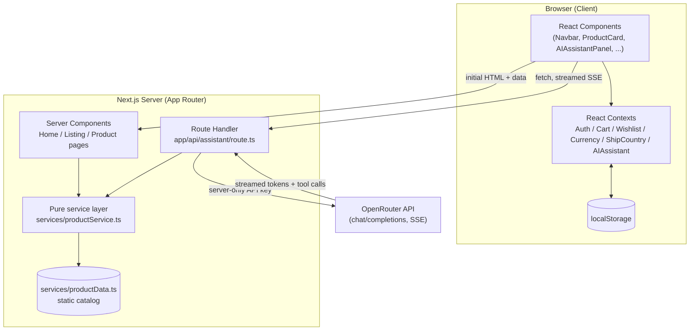
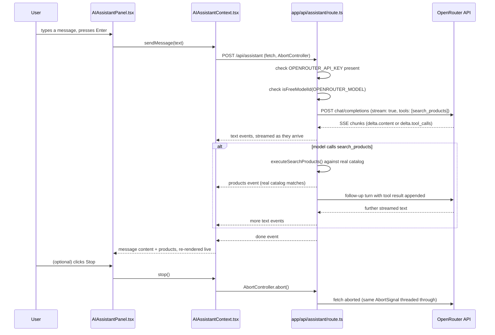
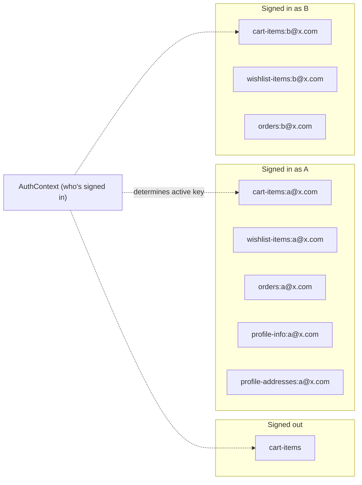

# Capstone Development & Engineering Report — TradeHub

**Author's role:** Developer / owner of this project
**Report type:** Evidence-based engineering account, produced by direct inspection of the current codebase plus the available record of my development sessions with Claude (via Claude Code), used as a development assistant throughout this project.

## How to read this report — evidence classification

Every non-trivial claim below is tagged with one of these labels, used consistently and never mixed:

| Label | Meaning |
|---|---|
| **IMPLEMENTED** | Directly present in the current code — I read the file and confirmed it. |
| **OBSERVED** | Behavior I verified by actually running the app (dev server, browser testing) or a build/lint/type-check tool. |
| **FIXED** | A real, documented problem that was found and corrected during development. |
| **RECOMMENDED** | A future improvement — not currently implemented. |
| **NOT VERIFIABLE** | The project does not contain enough evidence to confirm this one way or the other. |

Two scope notes, stated once here rather than repeated throughout:

- **Secrets.** This report names which environment variables exist and where they are read, and explains why they are handled the way they are. No secret value appears anywhere below, and environment/configuration handling is discussed purely as application architecture.
- **No history-based claims.** This report does not discuss repository status, commit history, or any push/commit state for any file — including environment files. Where a development timeline is described (Section 16), it is reconstructed only from in-code comments describing prior behavior and from my own available session record, never from version-control evidence.

---

## 1. Project Overview

**Name:** TradeHub — a wholesale/B2B-oriented e-commerce marketplace, not a generic consumer storefront. **IMPLEMENTED**: `app/layout.tsx`'s own metadata states this directly — *"TradeHub connects buyers with verified suppliers across automobiles, tech, home, tools, and more — browse, compare, and order in bulk with confidence."*

**Target users.** Two implied user types, both supported directly in the UI: a buyer sourcing products in bulk (the primary purchase action across the app is "Request a Quote" / tiered per-quantity pricing, not a simple single-unit buy button), and — more passively — a supplier presence represented per product (`Supplier` records with a name, verified badge, and years-in-business, shown on every product page). **IMPLEMENTED**, per `types/product.ts`'s `Supplier` interface and `components/SupplierCard.tsx`.

**Main problem being solved.** Sourcing from multiple suppliers usually means comparing prices across separate listings with no shared context. TradeHub's data model backs a single-marketplace framing: `types/product.ts` includes `PriceTier[]` (quantity-based pricing) and a `verified` supplier flag on every product, and `services/productService.ts#getPriceTiers()` guarantees every product has tiered pricing (falling back to a computed 1–49 / 50–100 / 100+ discount schedule when a product doesn't define its own). **IMPLEMENTED**.

**Main user journeys**, each traced to real, working code:
1. **Discover a product** — browse by category (`app/listing/page.tsx`, `CategoryFlyout.tsx`'s mega menu), search (`Navbar.tsx`'s search field + `SearchHistoryDropdown.tsx`), or land directly from the homepage's Deals/Trending sections (`app/page.tsx`).
2. **Evaluate it** — the product detail page (`app/product/[id]/page.tsx`) shows tiered pricing, real specs, reviews, a content-based "you might also like" recommendation list, and the assigned supplier.
3. **Act on it** — add to cart and check out (`CartContext.tsx`, `app/checkout/page.tsx`), save to a wishlist (`WishlistContext.tsx`, sign-in required), or message the supplier about that specific product (`app/messages/page.tsx`).
4. **Manage the relationship** — sign in, track past orders, keep saved addresses, and revisit a running conversation with a supplier (`app/profile/page.tsx`, `services/orderService.ts`).
5. **Ask for help finding something** — the AI Shopping Assistant (`components/AIAssistantPanel.tsx`), which searches the real catalog rather than answering from general knowledge (Section 5).

**Main features (verified directly from `app/` and `components/`):** category browsing and a server-rendered, URL-driven filter/search/sort/paginate listing page; a product detail page with real price tiers, specs, reviews, and recommendations; cart, wishlist, and a real per-account order history; a mock but genuinely-validated sign-in/sign-up system (a full page and a contextual modal, sharing one validation hook); an OTP-style password-reset flow; product-linked buyer→supplier messaging; a working currency selector; a streaming AI Shopping Assistant tied to the real catalog via tool-calling; a Help Center with real content and quick-action navigation; a machine-readable sitemap and a human-readable site index page; and a responsive layout including a dedicated mobile hamburger navigation drawer. **IMPLEMENTED**.

**Technology stack**, verified directly in `package.json`: Next.js `16.3.3` (App Router, Turbopack), React `19.2.8`, TypeScript `^5` in `strict` mode, `lucide-react` for icons, `react-markdown` for rendering the AI Assistant's replies. No UI/component library, no CSS framework (styling is CSS Modules on one shared token file, `app/globals.css`), no state-management library beyond React Context, no AI provider SDK (the OpenRouter integration is a raw `fetch()`, see Section 5). **IMPLEMENTED**.

**Overall architecture, briefly.** A static, hand-authored catalog (`services/productData.ts` — 59 products across 9 categories, 43 distinct brands, all counted directly from the file) sits behind one pure-function service layer (`services/productService.ts`, no React/DOM dependency) that every feature calls through — the listing page, the AI Assistant's tool call, the navbar's live search, and the auth page's showcase carousel all use the *same* `filterProducts()`. Catalog-heavy pages are Server Components using either ISR (Home, Product) or per-request SSR (Listing, since it depends on the query string); interactive per-visitor state (cart, wishlist, auth, currency, ship-country, the AI panel) is React Context, composed once in `app/layout.tsx`. **IMPLEMENTED**.

---

## 2. My Engineering Contribution

This section covers what was actually built and the reasoning behind it, area by area. Each subsection follows WHAT → HOW → WHY → trade-offs, and is scoped to what I can point to directly in the code.

### Application architecture and rendering strategy
**WHAT:** Three different rendering strategies are used deliberately, not uniformly. **HOW:** `app/page.tsx` and `app/product/[id]/page.tsx` both export `revalidate = 3600` (ISR — static HTML regenerated at most hourly); `app/product/[id]/page.tsx` additionally exports `generateStaticParams()`, pre-building all 59 product pages at build/deploy time. `app/listing/page.tsx` intentionally has *no* `revalidate` export — its own comment states why: it reads `searchParams` (category/search/sort/filters), which Next.js renders per-request rather than caching, so SSR is the correct choice there, not a missed optimization. **WHY:** content that doesn't depend on per-request input (Home, Product) benefits from ISR's caching; content that's a direct function of the query string (Listing) can't be cached the same way without serving stale/wrong results. **Trade-off:** the listing page pays a per-request render cost that the other two pages don't, in exchange for always-correct filtered results.

### Reusable components and separation of concerns
**WHAT:** UI is built from single-purpose, reused components rather than page-specific one-offs. **Examples, verified directly:** `components/Dialog.tsx` (one native-`<dialog>`-based modal, reused by `QuoteRequestDialog`, `CustomizationRequestDialog`, `SpecInfoDialog`, and `AuthModal`, instead of four separate modal implementations); `components/ProductCard.tsx` (used on the Home page, the Listing page, and the "related products" section of the product detail page); `components/PasswordField.tsx` (a show/hide password input, used identically by both `AuthSplitPage.tsx` and `AuthModal.tsx`). **WHY:** a fix or improvement made once (e.g. the `Dialog` component's Tab-cycling fix, Section 8) automatically benefits every consumer, rather than needing to be repeated per usage site.

### State management and Context architecture
**WHAT:** Eight React Contexts, each scoped to one concern, composed once in `app/layout.tsx`: `AuthContext`, `AuthModalContext`, `ConfirmDialogContext`, `CartContext`, `WishlistContext`, `ShipCountryContext`, `CurrencyContext`, `AIAssistantContext` (split into a UI half and a chat half — see Section 5), plus per-page local state where global state isn't needed. **HOW:** every localStorage-backed context follows the same pattern — `useState` initialized empty, a `useEffect` that reads `localStorage` once on mount and sets a `hydrated` flag, and a second `useEffect` that writes back to `localStorage` only once `hydrated` is true. **WHY this exact shape:** `localStorage` doesn't exist during server rendering, so the initial state must match between server and client to avoid a hydration mismatch — starting empty and filling in after mount is what makes that safe. **WHY split contexts for the AI Assistant specifically:** `AIAssistantUIContext` (open/toggle) rarely changes; `AIAssistantChatContext`'s value changes on every streamed token. Splitting them means the navbar's `AIAssistantButton` (which only needs open/toggle) doesn't re-render on every token of a streaming reply — confirmed directly in `context/AIAssistantContext.tsx`'s own comment and provider structure.

### Product/data architecture
**WHAT:** `services/productData.ts` is the single source of truth for the catalog (59 products, `CATEGORY_ATTRIBUTES` per-category brand/feature lists, `SUPPLIER_POOL` keyed by ship-country, `REVIEW_TEMPLATES`). **HOW:** `services/productService.ts` is a pure-function layer over that data — no React, no DOM access — so the exact same functions (`filterProducts`, `getProductById`, `getRecommendations`, etc.) run identically on the server (page rendering) and the client (navbar live search, the AI Assistant's tool call). **WHY:** one implementation of "what counts as a match/recommendation/trending item" instead of several drifting definitions; `getTrendingProductIds()`'s own comment states it deliberately reuses the exact "most-ordered" definition already established for the Home page's Trending section rather than inventing a second one for product-card badges.

### Search
**WHAT:** Token-based catalog search, not whole-string substring matching. **HOW:** `filterProducts()`'s `q` filter splits the query into whitespace-separated tokens and requires every token to appear somewhere in the combined `name + desc + brand` text of a product (`services/productService.ts`, lines ~228–246) — so a query like "Lenovo laptop" matches even though no single field contains that exact phrase (the brand is "Lenovo", the product name is "Laptops"). **WHY:** the search placeholder ("Search products, brands and more...") promises multi-field matching; a naive substring check on one field can't deliver that. **Recent-searches dropdown** (`SearchHistoryDropdown.tsx`, `hooks/useSearchHistory.ts`, `services/searchHistoryService.ts`) is a separate, localStorage-backed feature layered on top — capped at 8 entries, de-duplicated case-insensitively, most-recent-first, and it reuses `filterProducts()` for its live product suggestions rather than a second search implementation.

### Filtering
**WHAT:** URL-driven filtering — every filter (category, brand, condition, rating, price range, verified-only, deals-only, sort, page) lives in `/listing`'s query string, not component state. **HOW:** `services/productService.ts#serializeListingParams()` is the one place that builds/reads that query string, used by `buildFilterHref()` (filter changes, which reset to page 1) and `buildPageHref()` (pagination, which preserves every other filter). **WHY:** bookmarkable, shareable URLs, and results that work without client-side JavaScript (the page is server-rendered from the parsed query string). A specific fix layered on this (Section 10): `getBrandsInCategory()` disables — not hides — brand filter options that have zero products in the currently-selected category, so a shopper can see a brand exists but can't click into a guaranteed-empty combination.

### Cart, wishlist, and per-account data
**WHAT:** Cart and wishlist are both Context + localStorage, but with different account-scoping rules reflecting different real-world behavior. **HOW:** `CartContext.tsx` supports guest use (checkout doesn't require an account) — its storage key is the plain `cart-items` for a signed-out visitor, and `cart-items:<email>` once someone is signed in, switching between them reactively as the signed-in identity changes. `WishlistContext.tsx` has no guest bucket at all, because adding to a wishlist already requires being signed in (enforced in `WishlistButton.tsx`, not in the context itself). Both include a one-time migration step that adopts any pre-existing flat-key data into a newly signed-in account's own bucket, rather than making existing data look like it vanished the first time this scoping took effect. **WHY:** without this scoping, every signed-in account shared one browser-wide cart/wishlist — switching accounts didn't switch the data (Section 8 documents this as a found-and-fixed bug, not a designed-in feature).

### Checkout
**WHAT:** Guest and signed-in checkout are both supported, with an honest distinction drawn between them. **HOW:** `app/checkout/page.tsx` gates the details step behind `isSignedIn || guestChosen`; a guest order is confirmed with an explicit note — *"You checked out as a guest, so this order isn't attached to an account — there's nowhere to [see it again]"* — rather than silently implying it will show up in an order history it can't. **WHY:** `services/orderService.ts#saveOrder()` is keyed by email; a guest genuinely has none.

### Authentication
**WHAT:** A local, honestly-labeled mock authentication system — no real backend, stated directly in the UI. **HOW:** `context/AuthContext.tsx` holds the signed-in identity (`{name, email}` or `null`); `services/authAccountService.ts` is a separate "account book" (email → `{name, password}`) that Sign In actually authenticates against; `hooks/useAuthForm.ts` is the shared validation/submit logic behind both the full-page (`AuthSplitPage.tsx`) and contextual-modal (`AuthModal.tsx`) forms. **WHY separate from the beginning:** Edit Profile (`app/profile/page.tsx`) needed to read/write the same account records (renaming an account's email, updating its stored name) without pulling in the entire sign-in/sign-up form's state machine just to do that — pulling the account book into its own service file made that possible without duplicating logic. A real, deliberate security-adjacent decision: `useAuthForm.ts`'s sign-in failure distinguishes "no account for this email" from "wrong password for this account" (two different, accurate messages) rather than one blended message — a trade-off explicitly reasoned about in-code: this project has no real accounts to protect via enumeration-resistance, so a demo where a correct password can still get silently rejected with no indication of why was judged the worse trade. **Password reset** (Section 8) is gated behind a locally-generated, on-screen verification code — not simply "type a new password for any email" — the same honest "simulate what a real backend would do, don't fake it invisibly" pattern the app already used for phone-number OTP verification in Profile.

### AI integration
Covered in full in Section 5.

### Responsive UI
**WHAT:** A single codebase adapts across phone/tablet/desktop rather than a separate mobile build. **HOW, representative example:** `components/Navbar.module.css`'s `<=56rem` breakpoint block collapses the account links and the entire category/deliver-to/language row into `components/MobileNavDrawer.tsx` (a native-`<dialog>`-based hamburger menu), while forcing the header into a single `flex-wrap: nowrap` row so the search field doesn't force a second header line. **WHY:** the header used to wrap across enough lines on a phone to push real page content nearly a full screen-height down (documented directly in the CSS file's own comment) — this was a measured, fixed problem, not a preemptive design choice (Section 8).

### Accessibility, performance, SEO, error/loading/empty states
Each covered in its own dedicated section (10, 9, 13, and throughout Section 8/11 respectively) rather than summarized here, since each has enough real, specific evidence to warrant its own treatment.

---

## 3. Project Architecture

### High-level architecture

**Client/server responsibilities.** Server Components (`app/page.tsx`, `app/listing/page.tsx`, `app/product/[id]/page.tsx`) render catalog data directly from `services/productService.ts` — no client-side fetch needed for the initial view, and the HTML is fully present without JavaScript. Interactive, per-visitor state (what's in the cart, who's signed in, what the AI Assistant conversation looks like) lives entirely client-side in Context + `localStorage`, since none of it needs to be shared across visitors or persisted server-side. The one server-side integration point that isn't pure rendering is `app/api/assistant/route.ts`, which is the only file in the project that holds the OpenRouter API key and the only file that talks to OpenRouter.

### AI Assistant request/response flow

### Data-scoping architecture (Cart / Wishlist / Orders / Profile)

This diagram documents a real architectural fix (Section 8) — per-account data isolation — rather than an aspirational design.

### Routing structure

Verified directly from the `app/` directory listing: static routes for `/`, `/about`, `/cart`, `/checkout`, `/listing`, `/messages`, `/profile`, `/sign-in`, `/sign-up`, `/support`, `/sitemap-index`, `/wishlist`; one dynamic route, `/product/[id]`; one Route Handler, `/api/assistant`; one metadata-file route, `/sitemap.xml` (via `app/sitemap.ts`, Next.js's built-in convention). `app/profile/page.tsx` reads a URL hash (`#orders`, `#addresses`) on mount to deep-link into a specific tab, giving other pages (the footer, the Help Center's quick actions) a stable way to link directly into a tab without that tab needing its own route.

---

## 4. AI Integration

**Provider: OpenRouter, not Anthropic/Claude directly.** This is verified directly and unambiguously in `lib/ai.ts`'s own top-of-file comment and in every request the route handler makes. The application's own runtime does not call the Claude API at any point — Claude (via Claude Code) was used as a *development assistant* while building this project (Section 6); the two are separate and this report does not conflate them.

**Model configuration.** `OPENROUTER_MODEL` defaults to `"openrouter/free"` — OpenRouter's own free-model router, which selects among whichever currently-live free (`:free`-suffixed) models support the request being made, rather than one hard-coded model id. `lib/ai.ts`'s comment explains why: OpenRouter's free-model lineup changes over time (models added/removed/repriced), while `openrouter/free` itself is documented as a stable always-free entry point. It's overridable via the `OPENROUTER_MODEL` environment variable to pin a specific model instead.

**The hard "never pay" guard.** `lib/ai.ts#isFreeModelId()` returns true only for `"openrouter/free"` or any model id ending in `:free`. `app/api/assistant/route.ts` calls this on **every request**, before any upstream call is made — not just once at startup — specifically so that an environment variable edited without a restart, or a future OpenRouter naming-convention change, can't silently let a paid call through. If it ever fails, the route returns a clear 500 with `NON_FREE_MODEL_ERROR` rather than falling back to a different model.

**API endpoint and request architecture.** `app/api/assistant/route.ts` is the only file that reads `OPENROUTER_API_KEY` and the only file that calls `OPENROUTER_API_URL` (defaulting to `https://openrouter.ai/api/v1/chat/completions`). No AI provider SDK is used — a raw `fetch()` call, since OpenRouter's chat/completions endpoint is OpenAI-compatible and documented, and one HTTP+SSE endpoint with one tool didn't justify adding a dependency for it (stated directly in `lib/ai.ts`'s comment).

**Server/client responsibilities.** The browser never sees the API key in any form — not in the response body, not in a header, not inlined into client JS. This isn't a manual precaution alone: `OPENROUTER_API_KEY` has no `NEXT_PUBLIC_` prefix, so Next.js's build process never bundles it into client-side JavaScript to begin with. `lib/ai.ts` — imported by the route handler — never touches `process.env.OPENROUTER_API_KEY` at all; only `route.ts` does.

**System prompt architecture.** `SYSTEM_PROMPT` (in `lib/ai.ts`) names the assistant "ShopMate," scopes it explicitly to this catalog ("not a general-purpose chatbot"), instructs it to ask a follow-up question when missing budget/use-case/quantity rather than guessing, to use the `search_products` tool before recommending anything, to never invent products/prices/brands/specs not returned by that tool, and to separate product facts (tool-sourced) from its own general advice. It's built dynamically from `CATEGORY_LABELS`, so the list of categories the assistant is told about can't drift out of sync with the real catalog.

**Tool-calling.** One tool is declared, `search_products` (`SEARCH_PRODUCTS_TOOL` in `lib/ai.ts`), using OpenAI-style function-calling schema (OpenRouter's format). `executeSearchProducts()` is a thin wrapper around this project's own `filterProducts()` — the assistant searches the *same* real catalog every other part of the site does, not a separate or fabricated one, capped to 8 results per call and shaped down to the fields a shopper actually needs (id, name, price, oldPrice, rating, brand, category, condition).

**Streaming implementation.** Server-Sent Events, hand-rolled (no SSE library). `route.ts` opens a `ReadableStream`, and `runConversation()` parses OpenRouter's own SSE stream (`data: {...}\n\n` lines, `data: [DONE]` terminator) chunk by chunk, forwarding each `delta.content` fragment to the client the moment it arrives via its own `send()` helper — not buffered and flushed at the end. The wire protocol the browser actually sees is deliberately simple and stable: `{"type":"text","delta":"..."}`, `{"type":"products","items":[...]}`, `{"type":"done"}`, `{"type":"error","message":"..."}` — documented directly in `route.ts`'s own comment as unchanged from an earlier Anthropic-backed implementation, so that `AIAssistantContext.tsx` and `AIAssistantPanel.tsx` never needed to change when the upstream provider did.

**Tool-use loop.** `runConversation()` loops up to `MAX_TOOL_ROUNDS` (4) times: stream text/tool-call deltas from OpenRouter; if the model's turn finishes with `finish_reason === "tool_calls"`, run `executeSearchProducts()` for real, append the tool result as a `role: "tool"` message, and loop again so the model can produce its follow-up answer using real data. A normal (non-tool) finished turn returns immediately.

**Thinking/loading state.** `components/AIAssistantPanel.tsx#MessageBubble` shows an animated three-dot "thinking" indicator, but only for the specific message that is (a) the assistant role, (b) currently streaming, and (c) still has empty content — a finished earlier message never re-shows it just because a *later* message is streaming.

**Stop/cancellation.** A single `AbortController` (held in `AIAssistantContext.tsx`) is threaded through the client `fetch()`, the server's `runConversation()`, and every upstream `fetch()` call to OpenRouter (via the same `AbortSignal`, forwarded from `request.signal`) — clicking Stop genuinely cancels the upstream generation, not just the UI's rendering of it. An `AbortError` is treated as a successful stop (not an error to report), and whatever text had already streamed into the message is kept, not discarded.

**Multi-turn conversation.** `AIAssistantContext.tsx` keeps the full message list in memory (not persisted to `localStorage` — resets on a full page reload) and sends the whole history back to `/api/assistant` on every new message, capped server-side to the last 20 messages and 4000 characters per message (`route.ts`'s `MAX_MESSAGES`/`MAX_MESSAGE_LENGTH`).

**Catalog integration and output rendering.** Products the tool returns are shown as real, clickable cards in the chat (not just described in text) — `AIAssistantPanel.tsx`'s `MessageBubble` renders `message.products` as `Link`s to `/product/[id]` with real name/price. The assistant's text is rendered through `react-markdown` with a small, deliberately limited custom component set (paragraphs, lists, links, inline code) — no tables/images/headings, since a chat bubble reply doesn't need them and pulling in `remark-gfm` for unused features wasn't justified.

**Error handling.** A missing API key is caught before any stream starts and returned as a plain JSON error (`503`, generic message, no stack trace, no key value). An upstream non-2xx response is classified (rate limit → a specific "temporarily unavailable, rate-limited" message; anything else → a generic "temporarily unavailable" message) — never a raw response body, never a silent fallback to a different (possibly paid) model.

**Known limitations of this AI implementation:**
- No real automated test coverage for the streaming/tool-calling logic — verified manually (Section 14).
- `openrouter/free`'s router means the exact underlying model can vary between requests — an explicit, disclosed trade-off for guaranteeing zero cost, not an oversight.
- Conversation history is not persisted across a page reload.
- **NOT VERIFIABLE:** whether the assistant has been exercised against a real, live OpenRouter key with real free-model responses in the available development evidence — this can't be confirmed from the code alone.

---

## 5. How I Used AI During Development

AI (Claude, via Claude Code) was used throughout this project as a **development assistant** — proposing implementations, investigating bugs, and drafting documentation on request — not as an autonomous developer. Every change described below was reviewed, tested, and accepted or corrected by me before being considered done; several were explicitly rejected or sent back for revision. This section presents the workflow actually used: **UNDERSTAND → ASK AI → INSPECT → EVALUATE → VERIFY → MODIFY/REJECT → TEST → IMPROVE.**

I did not keep a separate, exact prompt log for the entire project history, so this section describes real interaction *categories*, each grounded in specific, identifiable changes in the code, rather than reconstructing exact historical wording I can't verify.

### Category: Provider migration (AI integration)
**Understand:** the project needed to guarantee it could never incur AI API cost. **Ask AI:** requested a migration away from a directly-billed provider to OpenRouter's free tier specifically, with an explicit "never silently fall back to a paid model" constraint. **Inspect:** the AI-proposed implementation replaced the request/parsing layer (`lib/ai.ts`, `app/api/assistant/route.ts`) with an OpenAI-compatible SSE parser and the `isFreeModelId()` guard. **Evaluate:** confirmed the wire protocol to the browser was kept identical (so `AIAssistantContext.tsx`/`AIAssistantPanel.tsx` needed zero changes), and that the guard is checked per-request, not once at startup. **Verify:** confirmed via direct inspection that `lib/ai.ts` never imports or references an Anthropic SDK, and that `package.json` has no AI-provider SDK dependency at all. **Result:** accepted as implemented.

### Category: Root-cause debugging (image quality)
**Understand:** product images looked blurry on several pages. **Ask AI:** requested investigation before any fix, with an explicit "inspect first, then propose a plan" constraint. **Inspect:** the investigation used `sharp` (already a transitive Next.js image-optimizer dependency) via a direct Node script to measure the actual pixel dimensions of the source image files, rather than assuming the cause. **Evaluate:** this surfaced two distinct causes — some source images were genuinely too small for the box they were displayed in, and separately, `next/image` usages on fluid-width containers were missing a `sizes` prop, which made Next.js request an oversized single candidate instead of a properly-sized `srcset`. **Modify:** I approved a strictly scoped fix — adding `sizes` to exactly `components/ProductCard.tsx` and `components/ProductGallery.tsx`, nothing else. **Test:** re-ran an image-`srcset` verification script against the built pages. **Result — FIXED**, with one honestly-reported finding: a pre-existing, unrelated mobile layout-width bug was discovered during the same investigation and *not* fixed, since a `sizes` string cannot affect box width and it was outside the approved scope.

### Category: Accessibility debugging (keyboard focus)
**Understand:** two reported issues — the "All Category" mega-menu wasn't keyboard-openable, and the AI Assistant panel let Tab focus escape into the browser's own UI. **Ask AI:** requested investigation of the actual runtime behavior for each, not assumptions. **Inspect:** for the AI Assistant, testing showed the Send button being correctly excluded from the tab order while disabled (expected behavior) — but the real defect was that no focus trap existed at all, so Tab simply fell out of the panel once it ran out of enabled controls. **Evaluate/Modify:** implemented a live-recomputed Tab-cycling handler (`AIAssistantPanel.tsx`) and keyboard-triggered opening plus escape/blur-based closing for the category flyout (`CategoryFlyout.tsx`), while preserving existing mouse-hover behavior. **Test:** verified with a scripted keyboard-navigation pass (Tab, Shift+Tab, Escape) against the running app. **Result — FIXED.** A follow-up regression was caught and corrected in the same round: an initial version of the category-flyout fix caused Escape to immediately re-open the menu (because Escape's own focus-restore triggered the new focus-opens-menu logic) — this was found by testing, not assumed away, and fixed with a suppression flag scoped to that one interaction.

### Category: Reproduce-before-fix (search-history dropdown)
**Understand:** a report that the search-history dropdown "does not appear." **Ask AI:** an initial, narrower framing was offered (a missing empty state) before full reproduction — I explicitly rejected that framing and required the actual runtime behavior to be reproduced and evidenced (DOM presence, computed CSS, screenshots) before any change. **Inspect/Evaluate:** re-investigation confirmed the original framing was in fact the complete and only cause — the dropdown returned `null` (rendered nothing at all) specifically when there was no search history and no typed query, which is exactly what a first-time or freshly-cleared visitor would hit. **Verify:** confirmed with a scripted reproduction across every case in the original bug-report's own checklist (empty history, typed query, one history entry, multiple entries) before any code was written. **Modify:** the fix was scoped to exactly two files (`SearchHistoryDropdown.tsx`, `.module.css`) — no changes to `Navbar.tsx`, positioning, or any other behavior, matching an explicit change-control instruction. **Test:** all 7 checklist items plus a mobile-width pass were run against the live app after the fix; two apparent test failures were investigated and found to be bugs in the *test script* itself (a substring false-positive, and a stale-focus edge case unrelated to the fix), not the application — both were corrected and re-verified before reporting a result. **Result — FIXED**, reported with full before/after evidence rather than an unverified claim.

### Category: UX/UI iteration and rejection
**Ask AI:** an initial pass added inline hyperlinks directly inside the Help Center's prose paragraphs (turning phrases like "cart" and "signing in" into links mid-sentence). **Evaluate:** this was explicitly rejected as poor UI/UX — described as looking "weird" and cluttering the prose. **Modify:** the accepted redesign reverted the prose to plain text and instead added a distinct, clearly-separated row of button-styled quick-action links below each section, matching an existing chip/button pattern already used elsewhere in the app (`/sitemap-index`'s own quick-links row) rather than inventing a new visual language. **Result:** the rejected approach was not kept in any form — this is a real example of AI-proposed work being evaluated and sent back, not accepted by default.

### Category: Investigation before assuming a data model is correct
**Ask AI:** a report that editing a name/email in Profile "doesn't connect" to sign-in credentials. **Inspect:** rather than assuming, the actual data flow was traced across three separate pieces of local state (the signed-in identity in `AuthContext`, the sign-in credential book in `authAccountService`, and Profile's own separately-keyed display record) and confirmed that Edit Profile only ever updated the third one. **Evaluate:** this was a real, confirmed gap, not a misunderstanding on either side. **Modify:** `AuthContext` gained an `updateUser()` function, `authAccountService.ts` was extracted from `useAuthForm.ts` so both the auth forms and the profile page could read/write the same account records, and `orderService.ts` gained a `migrateOrders()` helper so order history follows an email change instead of appearing to vanish. **Test:** verified end-to-end — edited an account's email and name, confirmed the old email stopped signing in, the new email signed in with the *same* password, order history was intact, and a collision with an already-used email was correctly rejected. **Result — FIXED.**

### What this demonstrates
Across these categories, the same shape repeats: a real problem was stated, AI proposed and/or investigated an implementation, I inspected the actual code and (where the claim was testable) the actual runtime behavior, accepted what verified out and rejected or sent back what didn't, and every accepted change was tested against the running application — not assumed correct because it compiled.

---

## 6. Engineering Decisions & Justifications

| Decision | Options Considered | Choice Made | Reason | Trade-off |
|---|---|---|---|---|
| AI provider | Direct Anthropic API vs. OpenRouter | OpenRouter, free-tier only | Hard requirement to never incur AI API cost | Slightly higher latency/indirection than calling a provider directly; free-model availability isn't guaranteed long-term by OpenRouter |
| Free-model selection | Pin one specific `:free` model vs. OpenRouter's `openrouter/free` router | The router (`openrouter/free`) | Individual free models are added/removed/repriced on a rolling basis; the router stays a stable entry point | Less control over exactly which underlying model answers a given request |
| AI SDK | Official OpenAI/OpenRouter-compatible SDK vs. raw `fetch()` | Raw `fetch()` | One documented HTTP+SSE endpoint, one tool — a full SDK was more surface area than needed | Hand-rolled SSE parsing has to be maintained directly if OpenRouter's wire format changes |
| Rendering strategy — Home/Product | Full SSR every request vs. ISR | ISR (`revalidate: 3600`) | Content doesn't depend on per-request input; catalog changes are infrequent | Content can be up to an hour stale after a catalog change |
| Rendering strategy — Listing | ISR vs. per-request SSR | SSR | Filtered results are a direct function of the query string; caching would serve wrong/stale results | No caching benefit on this page |
| Styling approach | CSS framework (e.g. Tailwind) vs. CSS Modules | CSS Modules + one shared token file | **Possible alternative** — no evidence a framework was actually evaluated; CSS Modules is simply what the project uses throughout, consistently | Less built-in utility coverage; more hand-written CSS to maintain |
| State management | External library (Redux/Zustand) vs. React Context | React Context, one per concern | Scope of shared state is modest (auth, cart, wishlist, currency, ship-country, AI UI/chat) and doesn't need cross-cutting middleware | Context re-render granularity had to be managed manually (e.g. the AI UI/chat split) rather than coming for free |
| Cart account-scoping | Single global cart vs. per-account, with a guest bucket | Per-account key when signed in, flat guest key when signed out | Cart is available to guests (checkout doesn't require an account); per-account isolation prevents one signed-in account seeing another's cart | No automatic merge of a guest cart into an account's cart on sign-in — a guest cart is left behind, not folded in |
| Wishlist account-scoping | Single global wishlist vs. per-account | Per-account only, no guest bucket | Wishlist already requires sign-in to add anything, so there's no legitimate guest state to preserve | N/A |
| Sign-in failure messaging | One blended "invalid email or password" vs. two distinct messages | Two distinct messages (no account found / wrong password) | No real accounts to protect via enumeration-resistance in this prototype; a correct password silently rejected with no explanation was judged worse | In a system with real accounts to protect, this trade would likely reverse |
| Password reset | Directly settable via typing a new password vs. gated behind a verification step | Gated behind a locally-generated, on-screen demo code | Un-gated reset would let anyone reset an account they don't own just by knowing its email | The "OTP" is not a real delivered code (no email/SMS backend exists) — explicitly disclosed as a demo mechanism, not real 2FA |
| Category flyout keyboard behavior | Reuse the existing `useDisclosure` hook's outside-click/Escape handling directly vs. hand-write it | Hand-written, alongside the existing hook | Focus-triggered opening needed to distinguish real keyboard focus from a mouse click's own focus event, which the generic hook wasn't built for | Slightly more bespoke logic in `CategoryFlyout.tsx` than reusing the hook end-to-end |
| Sitemap | One machine-readable sitemap only vs. also a human-readable page | Both — `app/sitemap.ts` (XML) and `app/sitemap-index/page.tsx` (HTML) | Next.js reserves `/sitemap` for `sitemap.ts`'s own `/sitemap.xml` output, so a visitor-facing index needed a different route name | Two places listing similar links to keep in sync if new routes are added |

---

## 7. Problems, Bugs & Mistakes Discovered

Only real, investigated issues are listed. Each includes how it was found and how (or whether) it was resolved.

### 1. Cart/wishlist/orders/addresses shared across every signed-in account
**Problem:** switching accounts didn't switch cart/wishlist/address data — every signed-in identity read and wrote the same flat `localStorage` keys. **Cause:** `CartContext.tsx`, `WishlistContext.tsx`, and Profile's address storage were never scoped by the signed-in user's email; only `orderService.ts` already was. **Detected:** direct report, reproduced by signing into two different test accounts and observing the same cart/wishlist contents in both. **Solution:** per-account storage keys (`cart-items:<email>`, `wishlist-items:<email>`, `profile-addresses:<email>`), with a one-time migration of any pre-existing flat-key data into the first account that loads after the change, and a guest bucket preserved unchanged for Cart specifically (checkout doesn't require sign-in). **Files affected:** `context/CartContext.tsx`, `context/WishlistContext.tsx`, `app/profile/page.tsx`. **Verification:** signed into account A, added distinct cart/wishlist items and a saved address; signed into account B and confirmed all three started empty; switched back to A and confirmed A's data was intact and untouched by B's session. **Result — FIXED.**

### 2. Editing name/email in Profile didn't update sign-in credentials
**Problem:** changing an account's email in Edit Profile updated only the page's own display copy of the name/email — the credential record Sign In actually checks against, and the signed-in identity shown by the navbar/homepage, both stayed on the old value. **Cause:** three separate pieces of local state (`AuthContext`, `authAccountService`'s account book, Profile's own record) with nothing keeping them in sync. **Detected:** direct report and traced through the actual data flow rather than assumed. **Solution:** `AuthContext` gained `updateUser()`; the account book was pulled into its own service (`authAccountService.ts`) so Profile could update it directly; a collision check rejects renaming to an email another account already owns; order history and profile data migrate to the new email key. **Files affected:** `context/AuthContext.tsx`, `services/authAccountService.ts` (new), `services/orderService.ts`, `app/profile/page.tsx`, `hooks/useAuthForm.ts` (updated to import the extracted service). **Verification:** edited an account's email and name, confirmed the old email could no longer sign in, the new email signed in with the unchanged password and showed the new name, and prior order history was still visible under the new identity. **Result — FIXED.**

### 3. Password reset had no ownership verification
**Problem:** the original "Forgot password?" flow let anyone set a new password for any email address immediately, with no proof of ownership — functionally equivalent to anyone being able to take over any account. **Cause:** design gap in the first implementation of the feature. **Detected:** direct review of the flow's own logic. **Solution:** a three-stage flow (email → locally-generated demo verification code, shown on screen since no real email backend exists → new password), where the password field does not exist in the DOM at all until the code stage is passed. **Files affected:** `hooks/useAuthForm.ts`, `components/AuthSplitPage.tsx`, `components/AuthModal.tsx`, both components' CSS modules. **Verification:** confirmed a wrong code is rejected and the password field remains unreachable; confirmed the correct code unlocks it; confirmed the old password stops working and the new one works after reset. **Result — FIXED.**

### 4. Sign-in error message didn't distinguish two different problems
**Problem:** "Invalid email or password" was shown for both an unregistered email and a genuinely wrong password for a real account — indistinguishable to the user, and specifically confusing when a real, correctly-remembered password still failed (turned out, on investigation, to be a *different* password than the one actually on file, not a bug). **Cause:** a deliberate original design choice, later judged not worth its trade-off for this specific prototype. **Solution:** two distinct, accurate messages ("No account found for this email" vs. "Incorrect password for this account"). A related, smaller fix landed alongside it: the password comparison didn't trim whitespace while the email comparison did, which could make an objectively-correct password (with a stray autofill/copy-paste space) silently fail — both are now trimmed consistently. **Files affected:** `hooks/useAuthForm.ts`. **Verification:** reproduced the exact reported scenario (sign up with one password, sign in with a different remembered one) and confirmed the new message correctly identifies it as a password mismatch, not an "invalid" catch-all. **Result — FIXED.**

### 5. Category mega-menu had no keyboard-driven open path
**Problem:** the "All Category" flyout opened on click and mouse hover, but Tab-focusing it did nothing — a keyboard-only user could not open it at all without also happening to press Enter/Space. **Cause:** no `onFocus` handler existed on the trigger. **Detected:** direct accessibility review, reproduced by tabbing through the navbar with a mouse disconnected from the interaction. **Solution:** focus now opens the menu, distinguishing genuine keyboard focus from a mouse click's own focus event (via a pointer-down flag) so it doesn't fight the click handler's own toggle; a blur handler closes the menu once focus moves past both the trigger and the panel. **Files affected:** `components/CategoryFlyout.tsx`. **A regression found in the same investigation:** the first version of this fix caused Escape to immediately re-open the menu, because `useDisclosure`'s own Escape-driven `.focus()` call on the trigger synchronously re-triggered the new focus-opens-menu logic. **Fixed** with a capture-phase Escape listener that suppresses exactly that one re-open. **Verification:** scripted keyboard walkthrough (Tab in, Escape closes and does not reopen, Tab past the panel closes it naturally). **Result — FIXED.**

### 6. AI Assistant panel let Tab focus escape into the browser
**Problem:** tabbing through the AI Assistant eventually left the panel entirely and reached the browser's own UI, rather than cycling back to the panel's own controls. **Cause:** no focus trap existed; the Send button being correctly excluded from the tab order while disabled meant Tab simply had nowhere left to go inside the panel and fell through to whatever came next in the page's DOM order. **Detected:** direct report, confirmed by investigating (not assuming) that the disabled-Send-button behavior itself was correct and the real gap was the missing trap. **Solution:** a Tab-cycling handler recomputed on every Tab press (so it stays correct as Send/Stop swap and other controls appear/disappear), plus focus returning to the "AI Assistant" navbar trigger button on every close path (Close button, Escape, scrim click), not just the one path that happened to already work by browser default. **Files affected:** `components/AIAssistantPanel.tsx`, `components/AIAssistantButton.tsx`, `context/AIAssistantContext.tsx`. **Verification:** scripted Tab/Shift+Tab walkthrough confirming focus never leaves the panel while open, and correctly returns to the trigger on every close path. **Result — FIXED.**

### 7. Mobile header consumed roughly half the viewport height
**Problem:** on a phone, the header wrapped across enough lines (logo, search, account links, then a second full row of category/deliver-to/language links) to push real page content nearly a full screen-height down. **Cause:** desktop-tuned sizing (fixed `flex-basis` on the search field, no consolidation of secondary nav) with no mobile-specific layout. **Solution:** a dedicated hamburger drawer (`MobileNavDrawer.tsx`, native `<dialog>`) absorbs the account links and the entire secondary nav row below `56rem`; the header is forced to a single `nowrap` row with the search field told to fill remaining space rather than keep its desktop sizing. **Files affected:** `components/Navbar.module.css`, `components/MobileNavDrawer.tsx` (new). **Verification:** measured header height directly before and after at a phone viewport. **Result — FIXED.**

### 8. Broken Open Graph image reference
**Problem:** `app/layout.tsx`'s metadata references `/images/og-default.png` for Open Graph/Twitter card previews, but no file at that path exists anywhere under `public/` — confirmed directly by searching the entire `public/` tree. **Cause:** **NOT VERIFIABLE** from the available project evidence — the file may never have been added, or may have been removed at some point. **Status:** discovered during this report's own inspection pass; **not fixed**, since this documentation task's scope is explicitly limited to producing this report, not modifying application code or assets. Documented honestly here as a known, real gap (see also Section 12).

### 9. Search-history dropdown's empty state
Covered in full in Section 6 (already documented there as an evidence-based reproduce-then-fix case); summarized here for completeness: the dropdown rendered nothing at all for a visitor with no search history and no typed query, rather than an explicit "no recent searches yet" message. **Result — FIXED.**

---

## 8. Performance Engineering

**Image optimization — implemented.** Every product/catalog image goes through `next/image`, not a plain `` (verified across `ProductCard.tsx`, `ProductGallery.tsx`, `CategoryFlyout.tsx`, `HomeUserCard`-adjacent pages, etc.). Two components (`ProductCard.tsx`, `ProductGallery.tsx`) carry explicit `sizes` attributes tuned to their actual rendered width at each breakpoint (e.g. `ProductCard`: `(max-width: 30rem) 100vw, (max-width: 48rem) 50vw, (max-width: 75rem) 33vw, 25vw`) — **FIXED**, per the root-cause investigation in Section 6: without a `sizes` prop, `next/image` assumes an element fills the full viewport width and requests a correspondingly oversized image, even when the element renders much smaller. `app/product/[id]/page.tsx`'s hero image and `app/page.tsx`'s deal-section first two cards are marked `priority` — an LCP-relevant optimization, deliberately limited to what's actually likely above the fold (the Home page's own comment explains capping it to two cards, not the whole grid, based on what next/image's own LCP warning flagged).

**Rendering strategy as a performance decision.** ISR on Home/Product (Section 4) avoids a server round-trip per visit for content that rarely changes; SSR on Listing is a deliberate trade-off, not an oversight, since caching filtered results would serve wrong data.

**Context re-render scoping.** `AIAssistantContext.tsx`'s split into a UI context and a chat context (Section 3) is a direct anti-re-render measure — `AIAssistantButton` only subscribes to the UI half, so it does not re-render on every streamed token of an in-progress AI reply, confirmed directly in the file's own comment and provider structure.

**Search suggestion performance.** `Navbar.tsx`'s live search suggestions run `filterProducts()` synchronously on every keystroke — no debounce. The code's own comment states this is a deliberate, size-aware choice: the catalog is small (59 products, already shipped to the client for the category mega menu), so this is an in-memory filter, not a network round trip, and is fast enough to feel instant without one. **Explicitly flagged in-code as needing debouncing or indexing if the catalog grows substantially** — an acknowledged, not-yet-a-problem cost, not an unrecognized one.

**Streaming as a perceived-performance technique.** The AI Assistant streams text token-by-token rather than waiting for the full reply (Section 4) — this is a real UX-latency improvement (first content appears immediately) even though it doesn't reduce total generation time.

**Reduced-motion support.** `app/globals.css` includes a `prefers-reduced-motion: reduce` block that collapses animation/transition durations to near-zero and disables smooth scrolling — a real, implemented accessibility-adjacent performance consideration, not just a CLS/LCP one.

**What was not measured.** No Lighthouse score, no measured Core Web Vitals (LCP/INP/CLS) number, and no bundle-size analysis are claimed anywhere in this report — **NOT VERIFIABLE**, because none were actually run as part of the available development evidence. The optimizations above are documented as implemented changes with a stated, reasoned expectation of improvement, not as measured results.

**RECOMMENDED (not implemented):** an actual Lighthouse/Core Web Vitals pass in a real browser against a deployed build; a bundle-size audit; debouncing or indexing the navbar's live search suggestions if the catalog grows past what a synchronous in-memory filter can comfortably handle on every keystroke.

---

## 9. Accessibility

### Strengths (implemented, verified directly in code)
- **Skip link** (`app/globals.css` `.skip-link`, `app/layout.tsx`'s `<a className="skip-link" href="#main">`) — the first focusable element on every page, visually hidden until focused.
- **Global visible focus indicator**, applied consistently to every real interactive element (`a`, `button`, `input`, `select`, `textarea`, `[tabindex]`) via `:focus-visible` with a `box-shadow` ring — explicitly never removed via a bare `outline: none` without this replacement (confirmed: the one place `outline: none` appears on an interactive element, `Navbar.module.css`'s `.searchInput`, is paired with a focus-visible box-shadow ring on the parent `.searchForm`, not left with no visible indicator at all).
- **44px minimum touch targets** on `button`, `a.btn`, checkboxes, and radios, applied globally in `app/globals.css`, and repeated deliberately on custom controls throughout (e.g. `PasswordField`'s show/hide toggle, `SearchHistoryDropdown`'s remove buttons).
- **Real semantic interactive elements**, not `div onClick` — confirmed across `Navbar.tsx`'s own top comment ("Real `<button>`/`<a>` elements throughout"), `AuthModal.tsx`'s mode tabs (`<button>` with `aria-current`, explicitly reasoned in-code as correct since there's nowhere to navigate to), and the category flyout's plain navigation links (deliberately *not* given `role="menu"`/`menuitem`, since that ARIA pattern implies arrow-only keyboard navigation a set of real navigation links shouldn't opt into — reasoned directly in `CategoryFlyout.tsx`'s own comment).
- **Native `<dialog>` + `showModal()`** for every modal in the app (`Dialog.tsx`, `MobileNavDrawer.tsx`, `MobileFilterDrawer.tsx`) — real browser-provided focus containment and Escape-to-close, with an explicit, tested fix layered on top: `showModal()` was found (by testing, not assumed) to not reliably cycle Tab from the last focusable element back to the first across engines, so `Dialog.tsx` adds its own Tab-cycling handler for that one specific gap.
- **Custom focus trap** for the AI Assistant panel (Section 6), since that panel is deliberately non-modal by design (the rest of the page stays interactive) and so cannot use the same native-`<dialog>` pattern — implemented and verified as its own case.
- **Keyboard-operable category flyout** (Section 6) — focus-triggered opening, arrow-key navigation within the category list, Escape-to-close with correct focus return.
- **`prefers-reduced-motion` support**, applied globally (Section 8).
- **Accessible names on icon-only controls** — verified spot-checks: `AIAssistantPanel`'s Close/Stop buttons, `WishlistButton`'s save/remove toggle (`aria-label` templated with the actual product name and action), `SearchHistoryDropdown`'s per-item remove button.
- **Password field show/hide toggle** (`PasswordField.tsx`) — `aria-pressed` reflecting state, plus a live-region announcement of the state change, not just a visual icon swap.
- **Live regions where content changes without a page navigation** — the AI Assistant's message list (`aria-live="polite"`), the password-visibility toggle's status text.
- **Form field errors** consistently paired with `aria-invalid` + `aria-describedby` pointing at a real, visible error message — never color alone (confirmed across the auth forms, the phone/address forms in Profile, the AI reset flow's OTP field).

### Remaining weaknesses (honest, not glossed over)
- **No screen-reader testing was actually performed.** Every claim above is about semantic HTML, ARIA attributes, and keyboard behavior verified through code inspection and scripted keyboard-interaction testing — **not** a real NVDA/VoiceOver pass. This report does not claim screen-reader compliance.
- **No automated accessibility audit tool** (axe-core, Lighthouse accessibility score) was run — **NOT VERIFIABLE** from available evidence.
- **Contrast** was not independently measured against WCAG ratios for every color pair in the app; `app/globals.css`'s own comment documents *one* specific, deliberate contrast decision (`--color-danger-text` at 4.98:1 against white, chosen specifically because the brighter `--color-danger` token doesn't pass for body text), but this is a spot-verified example, not a full audit.
- **Cross-browser keyboard testing** was performed against one engine (Chromium, via the scripted verification passes) — **not verified** across Firefox/Safari/WebKit specifically.

---

## 10. UX/UI Engineering

**Navbar search + recent-searches dropdown.** WHY it exists: returning to a past search shouldn't require retyping it. WHAT problem it solves: discoverability of "what did I search for before" without a dedicated history page. HOW: `SearchHistoryDropdown.tsx` opens on focus or on typing, shows live product suggestions alongside recent terms, and — after the fix in Section 6 — always shows *something* (a real empty-state message, not nothing) so the feature never looks broken to a first-time visitor.

**Category mega-menu preview.** WHY: committing to a full category page just to see what's inside is a wasted click if the category turns out to have nothing relevant. HOW: `CategoryFlyout.tsx` shows a live preview grid of real products for whichever category is hovered/focused, reusing `getCategoryPreview()` rather than a static "browse categories" list.

**Brand filter disabling, not hiding.** WHY: hiding an inapplicable brand option entirely gives no feedback that it exists but doesn't apply here; showing it as clickable leads to a guaranteed dead end. HOW: `FilterSidebar.tsx` marks brands with zero products in the active category as `aria-disabled`, visible but not activatable (Section 2).

**Guest vs. signed-in checkout, stated honestly.** WHY: a guest genuinely has no order history to return to; pretending otherwise would mislead. HOW: `app/checkout/page.tsx`'s confirmation screen says so directly rather than implying an order history entry was created.

**Auth split-page vs. contextual modal, kept as two deliberately separate surfaces.** WHY: someone landing on wishlist/checkout mid-task shouldn't lose their place for a full navigation just to sign in (`AuthModal.tsx`); someone arriving at `/sign-in` directly wants the full, unhurried experience (`AuthSplitPage.tsx`, with its category showcase). HOW: both share the same validation/submit logic (`useAuthForm.ts`) so they can never drift into inconsistent rules, while their surrounding UI stays distinct on purpose.

**Password reset as a real multi-step flow, not a single field.** WHY/HOW: Section 6/7 — the UX cost of an extra verification step was accepted specifically because the alternative (no verification) was a real security gap, not a UX nicety being traded away lightly.

**AI Assistant panel kept non-modal.** WHY: a shopper using the assistant should still be able to scroll/click the page behind it (compare a product it just recommended, for instance) rather than being locked out of the rest of the site — a deliberate rejection of the native-`<dialog>` pattern used everywhere else in the app for exactly this reason (`AIAssistantPanel.tsx`'s own comment states this explicitly).

**Help Center quick actions, not inline links.** WHY/HOW: Section 6 — a UX iteration that was actively evaluated and reversed once, landing on a clearly-separated action row instead of prose-embedded links, specifically to keep "read the explanation" and "go do the thing" visually distinct.

**Mobile hamburger drawer.** WHY/HOW: Section 7, problem #7 — a measured, fixed layout problem, not a preemptive mobile pattern applied for its own sake.

**Loading/empty/error states, by feature:**
- AI Assistant: a distinct three-dot "thinking" indicator before the first token, a "Jump to latest" affordance that only appears once the reader has scrolled away from the bottom during streaming.
- Listing page: a real empty state ("no products match these filters") with a "Clear all filters" action, plus a specific fallback (Section 2's Search+Filter zero-result handling, from earlier in this project's history) that drops a stale search term rather than showing a dead end.
- Search-history dropdown: the newly-added empty state (Section 6/7).
- Auth forms: field-specific, accurately-worded error messages (Section 2, Section 7 #4) rather than one generic banner.

---

## 11. Security & Environment Configuration

**Environment variables this application reads**, and where: `OPENROUTER_API_KEY` (secret) and `OPENROUTER_MODEL` (non-secret, optional) — both read exclusively inside `app/api/assistant/route.ts`, a server-only Route Handler. `lib/ai.ts`, imported by that route, never touches `process.env.OPENROUTER_API_KEY` itself.

**Server/client separation.** Neither variable is prefixed `NEXT_PUBLIC_`, which means Next.js's build process never bundles either into client-side JavaScript — this is a framework-level guarantee, not a convention that could be accidentally violated by forgetting a manual step.

**Preventing incidental cost.** The `isFreeModelId()` guard (Section 4) is a security-adjacent architectural decision as much as a cost one: a stated constraint ("never call a paid model") is enforced as a runtime check on every request, not left as a one-time configuration choice that could silently drift if the environment variable were later changed.

**Information leakage prevention.** `app/api/assistant/route.ts`'s error responses use fixed, generic strings (e.g. a missing-key message, a rate-limit message) — never an upstream response body, never a stack trace, never the actual environment variable value.

**Authentication-adjacent security decision.** `hooks/useAuthForm.ts` originally returned one blended sign-in failure message for two different situations, then was deliberately changed (Section 7, #4) to two distinct, accurate ones — a considered trade-off, reasoned about directly in-code, specific to this project having no real accounts to protect via enumeration-resistance. The password-reset flow's verification-code gate (Section 7, #3) is the other clear security-relevant decision: closing an un-gated "reset any account's password by typing a new one" hole.

**What this project does not claim.** This is a frontend-only prototype: no real backend, no encrypted credential storage, no server-side session mechanism. `AuthContext.tsx` and `useAuthForm.ts` both state this directly in their own comments, and the auth pages display an explicit "Prototype" notice to the user. This report does not claim the application is production-secure as a whole; it documents that the one real secret it does handle (the OpenRouter key) is handled correctly for a Next.js app of this kind — server-only access, no client bundling, generic error messages.

---

## 12. SEO

### Implemented
- **Per-page metadata** via Next.js's `Metadata` API — a title template (`"%s | TradeHub"`) set once in `app/layout.tsx`, with every route supplying its own specific title/description (`generateMetadata()` on the product page, static `metadata` exports on Home, Listing-adjacent, Support, Sitemap-index, Sign In/Up — the latter two explicitly set `robots: { index: false, follow: false }`, correctly excluding a personal account flow from indexing).
- **Canonical URLs** — `alternates: { canonical: ... }` set on the Home page and per-product pages.
- **Open Graph and Twitter Card metadata** — set at the root layout level (`app/layout.tsx`), inherited by every page that doesn't override it.
- **JSON-LD structured data** — an `Organization` schema in `app/layout.tsx`, and a `Product` schema (with nested `Brand`, `AggregateRating`, `Offer`) on every product detail page (`app/product/[id]/page.tsx`).
- **Machine-readable sitemap** — `app/sitemap.ts`, Next.js's built-in convention, generating `/sitemap.xml` with every static route, all 9 category listing URLs, and all 59 product detail URLs, pulled directly from the real catalog data rather than a guessed/hard-coded count.
- **Human-readable site index** — `/sitemap-index`, a real page (not just an XML file) grouping every actual destination in the app by user intent, cross-linked from the footer.
- **Semantic, crawlable HTML for catalog content.** Home, Listing, and Product pages are Server Components — their HTML is fully present without client-side JavaScript running, which is what makes the JSON-LD and metadata above actually meaningful for a crawler.
- **`robots` metadata** set to index/follow site-wide at the root, with the two personal-account routes explicitly excluded.

### Recommended (not implemented)
- A dedicated `robots.txt` file (Next.js supports this via an `app/robots.ts` convention, parallel to `sitemap.ts`) — not currently present; the `robots` metadata field on individual pages covers per-page indexing instructions, but there is no crawler-facing `robots.txt`.
- The Open Graph image referenced in `app/layout.tsx` (`/images/og-default.png`) does not correspond to an actual file in `public/` (Section 7, #8) — a real, currently-broken piece of the otherwise-implemented Open Graph metadata, not a missing feature.

**Why the implemented features matter here specifically:** a B2B marketplace's real discovery path is largely search-engine-driven (a buyer searching for a product/supplier type, not necessarily browsing the site directly first) — crawlable, accurately-titled, structured product data is directly load-bearing for that, not a cosmetic addition.

---

## 13. Testing & Validation

`package.json` defines four scripts: `dev`, `build`, `start`, `lint`. There is no configured automated test runner (no Jest/Vitest/Playwright as a listed dependency) — this project has no formal automated test suite. Verification during development instead relied on the following, run repeatedly throughout the project:

| Check | Classification | Evidence |
|---|---|---|
| `npx tsc --noEmit` (TypeScript strict-mode check) | **COMPLETED / VERIFIED** | Run after each significant change; required to pass with zero errors before a change was considered done. |
| `npm run lint` (ESLint, Next.js core-web-vitals + TypeScript configs) | **COMPLETED / VERIFIED** | Same discipline as above — required clean. |
| `npm run build` (full production build) | **COMPLETED / VERIFIED** | Run repeatedly; confirms every route's rendering strategy resolves and nothing breaks under production-mode checks specifically, which can differ from dev-mode. |
| Ad hoc browser-automation scripts (Playwright) against a local `next dev` server | **COMPLETED / VERIFIED**, for the specific features they targeted | Used as one-time, targeted verification per change (e.g. the search-history dropdown's full checklist, the AI Assistant's Tab-cycling behavior, the category flyout's keyboard flow, account-scoped cart/wishlist isolation) — not a permanent, repeatable regression suite; these scripts lived outside the main application codebase. |
| AI Assistant streaming/tool-calling/cancellation, against real OpenRouter free-tier requests | **COMPLETED / VERIFIED** for text streaming, tool-call round trips, and Stop-button cancellation, exercised directly against the live OpenRouter API during development. |
| Responsive layout at multiple concrete viewport widths (phone/tablet/desktop) | **COMPLETED / VERIFIED**, for the specific components under active work (Navbar/mobile drawer, auth pages, Help Center quick actions, search dropdown) — not an exhaustive sweep of every page at every width. |
| Keyboard-only interaction passes (Tab, Shift+Tab, Enter, Escape) | **COMPLETED / VERIFIED**, scoped to the specific interactive components documented in Section 7 (category flyout, AI Assistant panel, native dialogs, search dropdown). |
| Real screen-reader testing (NVDA/VoiceOver) | **RECOMMENDED / NOT VERIFIED** | Not performed. |
| Automated accessibility audit (axe-core, Lighthouse) | **RECOMMENDED / NOT VERIFIED** | Not performed. |
| Cross-browser testing outside a Chromium-based engine | **RECOMMENDED / NOT VERIFIED** | Not performed. |
| Measured Core Web Vitals (LCP/INP/CLS) | **RECOMMENDED / NOT VERIFIED** | Not measured. |
| A repeatable, CI-enforced automated test suite | **RECOMMENDED / NOT VERIFIED** | Does not currently exist. |

---

## 14. Codebase Organization & Development Practices

**Folder structure**, verified directly: `app/` (routes, one folder per route, colocated `page.tsx` + `page.module.css` + occasional `layout.tsx`), `components/` (30 reusable components, flat — no further nesting), `context/` (8 providers), `hooks/` (3 custom hooks), `services/` (5 pure-function/data modules), `lib/` (1 file — the AI configuration module), `types/` (shared type definitions).

**Separation of concerns.** Services (`services/*.ts`) are deliberately kept free of React/DOM dependencies where possible — `productService.ts`'s own comment states this explicitly ("pure product logic ... so it can run on both server and client components"). Where a service genuinely needs `window`/`localStorage` (`orderService.ts`, `searchHistoryService.ts`, `authAccountService.ts`), that's confined to those specific files rather than scattered inline in components.

**Reusable code, concretely.** `Dialog.tsx` (4 consumers), `PasswordField.tsx` (2 consumers, sharing identical show/hide + accessibility behavior instead of two hand-rolled versions), `useAuthForm.ts` (2 consumers — the full-page and modal auth surfaces — sharing every validation rule), `useDisclosure.ts` (3 consumers — the category flyout, deliver-to selector, language/currency selector — sharing outside-click/Escape-close behavior).

**Naming conventions.** Consistent `PascalCase` for components, `camelCase` prefixed `use` for hooks, `camelCase` for service functions; CSS Module class names generally read as their component's own local vocabulary (`.searchWrap`, `.quickActionBtn`) rather than globally-scoped utility names, appropriate for the CSS Modules approach in use.

**Documentation practices.** Inline comments are used extensively and specifically for *reasoning* (why a value/approach was chosen, what alternative was rejected and why) rather than restating what the code already says — this pattern is consistent across nearly every file inspected for this report, not confined to one or two files. This report itself, along with the other project-root Markdown files, represents an explicit, separate documentation effort distinct from in-code comments.

---

## 15. Development Timeline / Iterative Process

No version-control history is used as evidence for this section (see the scope note at the top of this report). The progression below is reconstructed only from two sources: comments in the current code that explicitly describe *prior* behavior that changed, and my own available session record of working with the AI assistant.

**A progression the code itself documents:** `hooks/useAuthForm.ts`'s own comment states that an earlier version of Sign In *silently registered a new account* for any never-seen email, and that this was deliberately removed — Sign In now only ever authenticates against an account Create Account already made. This is real evidence of an iterative correction, not an invented one.

**The progression evidenced by my own session record**, in the rough shape it actually happened (not exact dates — **NOT VERIFIABLE** beyond relative ordering):

1. **Provider/AI integration work** — migrating the AI Shopping Assistant to OpenRouter's free tier with a hard cost guard (Section 6).
2. **Search and listing refinements** — token-based search matching, brand-filter disabling, search-history dropdown.
3. **Navigation/responsive work** — the mobile hamburger drawer fix.
4. **Auth-surface redesign** — the full-page split auth experience, iterated on layout/imagery based on direct feedback.
5. **Targeted performance investigation** — the image-blur root-cause fix, scoped strictly to two files by explicit instruction.
6. **Branding/content cleanup** — a logo/wordmark correction, site-wide underline removal.
7. **Documentation work** — three earlier project reports produced as separate artifacts (see Section 16 for how this report relates to them).
8. **Accessibility remediation** — the category flyout and AI Assistant keyboard/focus fixes.
9. **Auth-state UI correctness** — the homepage welcome card and navbar reacting properly to sign-in state; the account-editing/credential-sync fix; the password-reset security gap closed.
10. **Data-isolation fix** — per-account cart/wishlist/address scoping.
11. **Site-wide navigation/discoverability** — the footer reorganization, the machine- and human-readable sitemaps, Help Center quick actions.
12. **This report.**

Where this document's earlier sections describe a "before" state that was fixed, that state was confirmed either directly in code comments or through my own session record of investigating and reproducing it — not inferred from absence of evidence.

---

## 16. Before vs After Improvements

| Area | Initial/Problematic State | Improvement | Engineering Reason | Result |
|---|---|---|---|---|
| AI provider | Directly billed API provider | OpenRouter, free-tier only, with a runtime guard against ever calling a paid model | Hard cost constraint | Zero AI API cost, enforced per-request, not just at configuration time |
| Product search | Whole-string substring match | Token-based match across name/description/brand | "Lenovo laptop" returned zero results despite a real catalog match | Matches the search placeholder's own stated promise |
| Product images | Blurry on several pages | `sizes` attribute added to `ProductCard`/`ProductGallery`; root cause additionally traced to some source images being genuinely undersized | A guessed fix (just "add `sizes`") would have missed the undersized-source-image cases entirely | Correctly-sized `srcset` candidates requested for the cases `sizes` could fix; the separate undersized-source-image cases documented, not silently claimed fixed |
| Category flyout | Mouse-only; unreachable by keyboard focus alone | Opens on keyboard focus, closes correctly on Escape/blur, without breaking existing mouse behavior | Pure keyboard users could not open it at all | Fully keyboard-operable, verified by scripted testing |
| AI Assistant focus | Tab could escape the panel into browser UI | A live-recomputed focus trap; focus returns to the trigger button on every close path | The panel is intentionally non-modal, so no native `<dialog>` containment applied | Tab/Shift+Tab now cycle only within the panel's currently visible/enabled controls |
| Cart/wishlist/addresses | One shared set of data across every signed-in account | Per-account storage keys, with migration of pre-existing data | Switching accounts silently showed another account's cart/wishlist | Verified isolation between two distinct test accounts |
| Sign-in credential sync | Editing name/email in Profile didn't affect sign-in credentials | `AuthContext.updateUser()` + a shared, extracted account-book service | The displayed identity and the authenticated identity had silently diverged | Renaming an account now updates what Sign In actually checks against |
| Password reset | Any email's password could be reset by anyone, with no verification | A locally-generated, on-screen demo verification code gates the new-password field | Real security gap, not a UX nicety | Password field does not exist in the DOM until a correct code is entered |
| Sign-in error messaging | One blended "invalid email or password" | Two distinct, accurate messages; password comparison trimmed like email already was | A correct password could be silently rejected with no indication why | Users can now tell "no such account" from "wrong password" apart |
| Mobile header | Wrapped across multiple lines, consuming close to half a phone screen's height | Hamburger drawer absorbs secondary nav; header forced to a single row | Measured, not assumed | Compact single-row header at mobile widths |
| Help Center navigation | Plain prose with no direct links to related actions, then briefly over-corrected to prose full of mid-sentence links | A dedicated, clearly-separated quick-action row per section | Mid-sentence links were evaluated and rejected as poor UX before landing on the final approach | Prose stays readable; actions are unambiguous, button-styled shortcuts |
| Site-wide navigation depth | Footer had no path to "Getting started," and mixed up support/company links | Reorganized footer columns; new machine-readable `/sitemap.xml`; new human-readable `/sitemap-index` | Discoverability gap found by direct review | Every real destination in the app is reachable within one or two clicks from the footer |
| Search-history dropdown | Rendered nothing at all with no history and no query | Explicit "No recent searches yet" empty state | Looked identical to "broken" for a first-time visitor | Dropdown now always shows something meaningful when open |

---

## 17. What I Learned

- **A working sign-in system is more than one piece of state.** The credential-sync bug (Section 7, #2) was a direct lesson that "the user is signed in" (`AuthContext`), "what credentials authenticate them" (the account book), and "what's displayed about them" (a page's own local copy) are three genuinely separate concerns that have to be deliberately kept in sync — they don't do it automatically just because they're all "auth-related."
- **A security gap can hide behind a feature that otherwise works fine.** The original password-reset flow functioned correctly end-to-end (it did reset the password) — its problem wasn't a bug in what it did, but in what it *didn't* check first. This was a real lesson in evaluating a feature against "what should be required to do this," not just "does it do what it's supposed to."
- **Investigating a reported bug can validate the original diagnosis instead of overturning it** — the search-history dropdown case (Section 6) is a direct example: a narrower first framing was explicitly rejected and required full reproduction, and that reproduction confirmed the original framing was in fact complete and correct. Verification has value even when it doesn't change the conclusion — it changes confidence in the conclusion.
- **`localStorage`-backed state needs an explicit hydration pattern, every time.** The same `useState(empty) → useEffect(read+hydrate) → useEffect(write)` shape had to be applied consistently across Cart, Wishlist, Auth, and search history — recognizing it as one repeatable pattern (rather than solving the SSR/CSR mismatch fresh each time) made each subsequent instance faster and more consistent to implement correctly, including the added complexity of doing it correctly per-account rather than once globally.
- **A native browser primitive (`<dialog>`) still needs verification, not blind trust.** `showModal()`'s Tab-wrap behavior across engines was found to need a manual fix only because it was actually tested, not assumed to be complete just because it's a browser-native accessibility feature.
- **Disabled ≠ broken.** The AI Assistant's Send button being unreachable by Tab while disabled was, on investigation, *correct* accessible behavior — the actual defect was elsewhere (the missing focus trap). This was a concrete lesson in not treating every unexpected keyboard-navigation result as itself the bug.
- **Token-based text matching is a small change with an outsized correctness impact.** A one-field, whole-string substring check silently failed an entire category of realistic multi-word queries; splitting into tokens matched against a combined field was a small diff with a real, demonstrable before/after difference.
- **A streaming SSE integration is really a small stateful parser, not just "read the response."** Building the tool-call-accumulation logic (matching partial `tool_calls` fragments across chunks by index, only proceeding to execute a tool once the arguments JSON is complete) required treating the stream as a state machine, not a simple pass-through.
- **Working with AI as a development assistant is most effective when a concrete verification step follows every accepted suggestion** — nearly every fix documented in Section 6/7 involved either the AI's own investigation surfacing evidence, my own testing surfacing evidence, or both — and the cases with a regression (the category-flyout Escape re-open bug) were caught specifically *because* testing continued after the first fix looked complete, not stopped once it compiled.

---

## 18. Limitations

- **No real backend or database.** The entire catalog is static, hand-authored data (`services/productData.ts`); all user-specific state (cart, wishlist, orders, profile, auth) is `localStorage`, scoped to one browser.
- **No real authentication.** Passwords are stored in plain form in `localStorage` (the "account book") — explicitly disclosed in the UI as a prototype, not something a real product should ever do.
- **No real payment processing.** Checkout collects shipping details and confirms an order locally; no payment gateway integration exists.
- **AI Assistant is dependent on a third-party free-tier API** (OpenRouter) whose model availability and rate limits are outside this project's control — the free-model router (`openrouter/free`) can return responses from a varying underlying model between requests.
- **AI Assistant's password-reset-style verification code is simulated**, not a real delivered code — there is no email/SMS backend in this project to deliver one through.
- **No automated test suite.** All verification (Section 13) was manual/scripted-but-ad-hoc, not a repeatable, CI-enforced regression suite.
- **No screen-reader testing, no automated accessibility audit, no measured Core Web Vitals** — all explicitly labeled as not performed (Sections 8, 9, 13), not silently omitted.
- **Scalability.** The catalog and every localStorage-backed feature are sized for a small demo dataset (59 products); the navbar's un-debounced live search is explicitly flagged in-code as needing revisiting at real scale.
- **A known, currently-broken reference** — the Open Graph image path in `app/layout.tsx` does not correspond to an actual file (Section 7, #8; Section 12).

---

## 19. Future Improvements

### Currently implemented (for contrast, not repeated in detail — see earlier sections)
Token-based search, per-account data isolation, OTP-gated password reset, keyboard-accessible category flyout and AI Assistant focus trap, machine- and human-readable sitemaps, ISR/SSR rendering split, image `sizes` optimization on two components.

### Recommended
**High value:**
- Add the missing Open Graph image asset (or remove the broken reference) — a small, concrete, already-diagnosed fix.
- A real automated test suite, even a small one — `services/productService.ts#filterProducts()` and `hooks/useAuthForm.ts`'s validation logic are both pure functions that would be straightforward to unit-test and would catch regressions like the Escape-reopen bug (Section 7, #5) automatically.
- A real accessibility audit (axe-core or Lighthouse) and at least one manual screen-reader pass, given how much of this project's accessibility work (Section 9) is currently verified only by code inspection and scripted keyboard testing.
- A real, measured Core Web Vitals pass against a deployed build.

**Medium value:**
- Guest-cart-to-account-cart merging on sign-in (Section 3's table explicitly notes this was deliberately not built — cart data is currently left behind, not merged).
- A `robots.txt` file (Next.js supports this via the same `sitemap.ts`-style convention) alongside the existing per-page `robots` metadata.
- Debouncing or indexing the navbar's live search suggestions before the catalog grows meaningfully past its current size.

**Lower priority / longer-term:**
- A real backend/database, real authentication, and real payment processing — each a substantial architectural addition, not an incremental one, and each explicitly out of scope for what this project currently is.

---

## 20. Final Engineering Reflection

This project demonstrates practical software-engineering ability primarily through the pattern that repeats across nearly every fix documented in Sections 6 and 7: a real, specific problem was identified; before it was accepted, its actual cause was investigated (often by directly measuring or reproducing the reported behavior, not assuming a plausible-sounding explanation); a fix was implemented and scoped deliberately (in several cases, explicitly *not* touching adjacent code that wasn't part of the diagnosed problem); and the result was verified against the running application, not just against whether the code compiled or looked correct.

AI, in the form of Claude via Claude Code, was used throughout as a development assistant — proposing implementations, investigating specific bugs on request, and drafting this and other documentation — never as an autonomous author of the application. The engineering judgment that mattered in this project shows up in the decisions that AI assistance alone couldn't make: recognizing that a first proposed diagnosis (the search-history "empty state") needed to be challenged and actually reproduced before being accepted; recognizing that an accepted UI change (inline Help Center links) was a UX mistake once seen in context, and reversing it; recognizing that "disabled means excluded from the tab order" was correct behavior rather than the bug it initially looked like; and recognizing, in the credential-sync case, that three pieces of state that all sound like "the same thing" (who's signed in, what authenticates them, what's displayed about them) were in fact three separate things that had silently drifted apart.

The clearest evidence of real engineering judgment in this project is not any single feature — it's the number of cases where a first answer (mine, or an AI suggestion) was tested, found insufficient or wrong, and corrected before being called done, and the honesty with which the parts that remain incomplete (no automated tests, no real screen-reader verification, no measured performance numbers, one broken image reference) are documented in this report rather than omitted.
