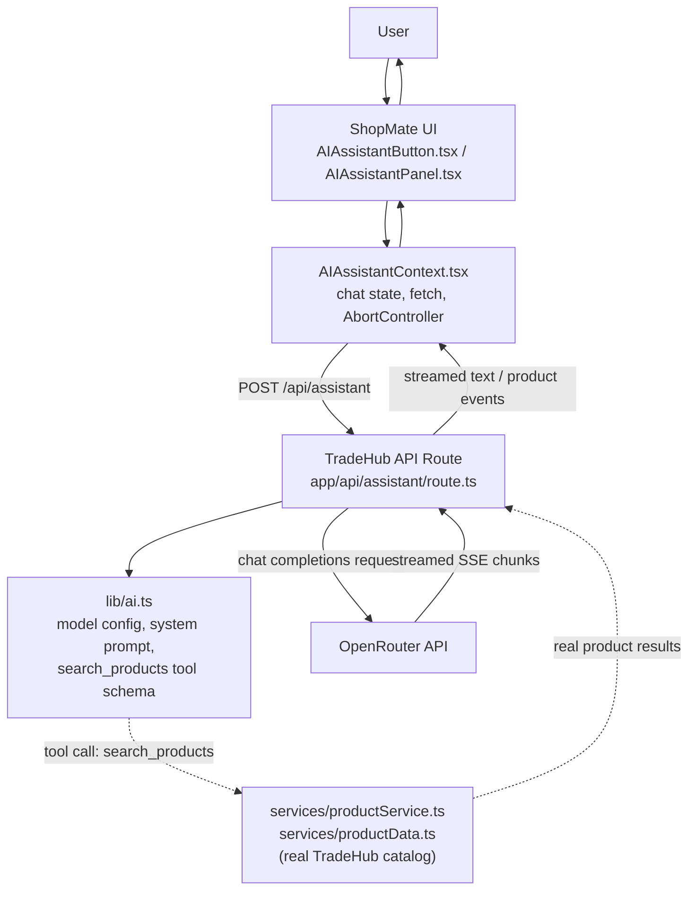

# TradeHub

TradeHub is a wholesale/B2B-style e-commerce marketplace capstone project built with Next.js. Buyers browse a real product catalog with tiered bulk pricing, message verified suppliers, and manage carts, wishlists, and orders — with an integrated AI Shopping Assistant, **ShopMate**, built directly into the storefront to help shoppers find products from the real catalog.


---

## Table of Contents

- [Project Brief](#project-brief)
- [Live Deployment](#live-deployment)
- [Overview](#overview)
- [Key Features](#key-features)
- [AI Shopping Assistant — ShopMate](#ai-shopping-assistant--shopmate)
- [AI Architecture](#ai-architecture)
- [Tech Stack](#tech-stack)
- [Project Structure](#project-structure)
- [Getting Started](#getting-started)
- [Environment Variables](#environment-variables)
- [Available Scripts](#available-scripts)
- [Testing](#testing)
- [Performance](#performance)
- [Accessibility](#accessibility)
- [SEO](#seo)
- [Security](#security)
- [Deployment & Operations](#deployment--operations)
- [AI-Assisted Development](#ai-assisted-development)
- [Documentation](#documentation)
- [Limitations](#limitations)
- [Future Improvements](#future-improvements)
- [Reflection](#reflection)
- [License / Project Status](#license--project-status)

---

## Project Brief

TradeHub solves the problem of bulk/wholesale product sourcing being poorly served by generic consumer storefronts: a business buyer typically has to compare per-unit prices across separate supplier listings with no shared context, no quantity-based pricing, and no quick way to describe what they need in plain language and get a grounded answer back. TradeHub addresses this with a single marketplace where every product carries real quantity-based price tiers, every listing is tied to a verified supplier a buyer can message directly, and an integrated AI assistant (ShopMate) can search the same real catalog on the buyer's behalf instead of requiring them to manually work through filters. It's built for two overlapping audiences: capstone reviewers evaluating an AI-enhanced, accessible, production-considered frontend, and — in the role it's designed to play — a small-to-mid-size buyer sourcing products in bulk from suppliers. This idea was chosen specifically to combine a genuinely non-trivial frontend (tiered pricing, URL-driven filtering/sorting/pagination, per-account data isolation, accessible modal and navigation patterns) with an AI feature that is meaningfully grounded in the application's own data, rather than a chatbot bolted on top with no real connection to the product catalog.

## Live Deployment

**Production URL:** [https://ecommerce-ai-capstone.vercel.app/](https://ecommerce-ai-capstone.vercel.app/) — confirmed loading: the homepage renders as TradeHub with product categories, search, cart/wishlist/account controls, and the ShopMate button present.

**Repository:** [https://github.com/Hafsa0104/ecommerce-ai-capstone](https://github.com/Hafsa0104/ecommerce-ai-capstone)

**Platform:** Vercel, inferred from the `*.vercel.app` production URL. No `vercel.json` or other deployment configuration file is present in this repository, so beyond that inference, no further platform settings (build overrides, environment variable configuration, etc.) can be confirmed from the code — see [Deployment & Operations](#deployment--operations).

**Functional confirmation:** the production URL loads correctly and serves the storefront. The live end-to-end ShopMate flows (product search, streaming, cancellation) described under [Testing](#testing) were verified against a development server, not re-run against this production URL specifically.

**Accessibility considerations for this deployment:** the accessibility features listed under [Accessibility](#accessibility) are implemented in the source and ship to this deployment as-is; they have not been re-audited against the live URL (no formal audit — automated or manual — has been run).

## Overview

TradeHub connects buyers with verified suppliers across categories such as automobiles, tech, home interiors, tools, sports, pets, machinery, and gifts. It is designed around a bulk/wholesale purchase model rather than single-unit retail: every product carries quantity-based price tiers (the more you order, the lower the per-unit price), and the primary action on a product page is a supplier quote/inquiry flow, alongside a full cart-and-checkout path for direct purchase.

**Architecture, honestly stated:** this is a frontend-focused capstone/prototype. The product catalog, pricing logic, filtering, and marketplace flows are real and fully functional. There is **no production backend or database** — all user-specific data (accounts, cart, wishlist, orders, saved addresses) is persisted client-side in the browser's `localStorage`, scoped per signed-in account. This is a deliberate scope decision for a capstone project, disclosed directly in the app's own UI (the auth pages show an explicit "Prototype" notice).

## Key Features

The features below reflect what is actually implemented in the codebase. Storefront functionality does not depend on any external service and has been exercised directly.

- **Category browsing & search** — a mega-menu category flyout with live product previews, a navbar search field with a recent-searches dropdown (`localStorage`-backed) and live product suggestions, and token-based catalog search (multi-word queries match across product name, description, and brand).
- **Filtering, sorting & pagination** — server-rendered, fully URL-driven listing page: category, brand, condition, rating, price range, verified-only, and deals-only filters, plus sorting, with filter state living in the query string so results are bookmarkable and shareable.
- **Product detail pages** — quantity-based price tiers, full specs, customer reviews, a content-based "related products" recommendation engine, and the assigned supplier for that product.
- **Supplier information & messaging** — each product carries an assigned supplier (name, verified badge); buyers can message a supplier directly about a specific product, with conversation threads shown under Messages.
- **Cart & checkout** — supports both guest checkout and signed-in checkout; cart contents are scoped per signed-in account (and separately for guests), not shared across different accounts in the same browser.
- **Wishlist** — sign-in gated, scoped per account.
- **Order history** — placed orders are saved per signed-in account and viewable from the profile page.
- **Authentication (prototype)** — sign in / create account, available both as a full-page flow and as a contextual popup dialog for account-gated actions. Includes real validation, accurate error messages (distinguishing "no account for this email" from "wrong password"), and an OTP-style password-reset flow gated behind a verification code. This is a local, `localStorage`-backed mock system with no real backend, disclosed directly in the UI.
- **Profile & addresses** — editable name/email/phone (kept in sync with sign-in credentials), saved addresses, and order history.
- **Currency & delivery-country selection** — prices convert across currencies; product shipping availability reflects the selected delivery country.
- **Responsive design** — a dedicated mobile hamburger navigation drawer, responsive listing/filter layouts, and touch-friendly controls.
- **Accessibility** — see [Accessibility](#accessibility).
- **SEO** — see [SEO](#seo).
- **Help Center** — real content covering getting started, shipping, and returns/refunds, with quick-action shortcuts into the rest of the app.
- **AI Shopping Assistant (ShopMate)** — see below.

## AI Shopping Assistant — ShopMate

ShopMate is not a separate application — it is a chat panel built directly into the TradeHub storefront, opened from a button in the navbar, and it answers shopping questions using TradeHub's own product catalog.

> **Testing status:** live, end-to-end behavior against a real OpenRouter API key (basic conversation, product search with real catalog results, multi-turn follow-up, honest no-match handling, and Stop/cancellation mid-response) was exercised directly in a running instance of this app during development and produced correct results in that session — see [Testing](#testing) for exactly what was checked and how. This is developer-side verification against a development server, not a formal or externally-audited test, and it has not been re-run against a deployed production instance.

- **Integration point:** `components/AIAssistantButton.tsx` (navbar trigger) and `components/AIAssistantPanel.tsx` (the chat UI) are rendered once at the app root (`app/layout.tsx`), alongside every other page — ShopMate is available from anywhere in TradeHub, not a standalone page.
- **Provider:** [OpenRouter](https://openrouter.ai) — not a direct Anthropic/Claude API integration, and not any other provider. Implemented as a plain `fetch()` call to OpenRouter's OpenAI-compatible chat completions endpoint (`app/api/assistant/route.ts`); no AI provider SDK is used.
- **Free tier only, by design:** the app defaults to OpenRouter's `openrouter/free` model router and includes a runtime guard, `isFreeModelId()` in `lib/ai.ts`, that refuses to call any model that is not free — checked on every request, not only at startup.
- **System prompt:** `lib/ai.ts`'s `SYSTEM_PROMPT` establishes ShopMate's persona ("the shopping assistant built into this e-commerce marketplace... not a general-purpose chatbot"), instructs it to ask a short follow-up question when it's missing budget/use-case/quantity instead of guessing, to use the `search_products` tool before recommending anything, and explicitly never to invent a product, price, brand, or spec that didn't come from a real tool result.
- **Grounded in the real catalog, not invented products:** the assistant can call one tool, `search_products` (defined in `lib/ai.ts` as an OpenAI-style function-calling schema), which runs against TradeHub's actual product data via `services/productService.ts` and `services/productData.ts` — the same filtering logic the listing page itself uses. There is no separate or fake product data source for the AI to draw from.
- **Streaming responses:** replies are implemented to stream token-by-token over Server-Sent Events (SSE), with a "thinking" indicator shown before the first token and a "Jump to latest" control while scrolled away during streaming.
- **Cancellation:** a Stop button aborts the in-progress generation, on both the client request and the upstream call to OpenRouter, via a shared `AbortController` threaded from `AIAssistantContext.tsx` through `app/api/assistant/route.ts` into every upstream `fetch()`.
- **Multi-turn conversation:** the current message history is sent with each request, so follow-up questions retain context; the conversation itself is held in memory and resets on a page reload (see [Limitations](#limitations)).
- **Product cards:** when the tool returns matching products, they are rendered as real, clickable product cards in the chat panel, linking to their actual TradeHub product pages — not described only in text.
- **Markdown rendering:** assistant replies are rendered with `react-markdown`.
- **Error handling:** a missing API key, a non-free model configuration, or an upstream OpenRouter failure each produce a clear, generic message in the chat UI rather than an unhandled failure or a leaked error body/stack trace. The real cause of an upstream failure is logged server-side only (status code and a truncated response body, never the API key), so it's diagnosable from the server console without ever exposing it to the browser.
- **Responsive & accessible:** the panel is usable at mobile and desktop widths, and implements a keyboard focus trap while open, visible focus indicators, and returns focus to the triggering button on close.
- **Server-side API key handling:** `OPENROUTER_API_KEY` is read only inside `app/api/assistant/route.ts` and is never sent to the browser in any form.

## AI Architecture



**How the pieces fit together:**
- `AIAssistantButton.tsx` toggles the panel open/closed and is the only visible entry point in the navbar.
- `AIAssistantPanel.tsx` is the chat UI itself — message list, the composer, the Stop button, and the "thinking" indicator.
- `AIAssistantContext.tsx` holds the conversation state, sends the `fetch()` request to the API route, parses the streamed SSE response (a small custom wire format: `{"type":"text","delta":...}`, `{"type":"products","items":...}`, `{"type":"done"}`, `{"type":"error","message":...}`), and owns the `AbortController` used for cancellation.
- `app/api/assistant/route.ts` is the **only** server-side code that talks to OpenRouter. It reads `OPENROUTER_API_KEY`, enforces the free-model guard, streams OpenRouter's response back to the client, and — when the model calls the `search_products` tool — executes that tool server-side.
- `lib/ai.ts` defines the model configuration, the system prompt, and the `search_products` tool schema; it never reads `process.env` itself — only `route.ts` does.
- `services/productService.ts` and `services/productData.ts` are TradeHub's own catalog and filtering logic — the same functions the listing page uses — so the assistant's tool results and the storefront's own search results come from one shared source of truth, not two separate implementations.

## Tech Stack

Taken directly from `package.json`.

**Core**
- [Next.js](https://nextjs.org) `16.3.3` (App Router, Turbopack)
- [React](https://react.dev) `19.2.8` / `react-dom` `19.2.8`
- [TypeScript](https://www.typescriptlang.org) `^5` (strict mode)

**Libraries**
- [`lucide-react`](https://lucide.dev) `^1.34.0` — icon set
- [`react-markdown`](https://github.com/remarkjs/react-markdown) `^10.1.0` — renders ShopMate's replies

**Tooling**
- ESLint `^9` with `eslint-config-next` `16.3.3`
- `@types/node`, `@types/react`, `@types/react-dom`

**Styling:** CSS Modules on one shared design-token stylesheet (`app/globals.css`) — no CSS framework or UI component library.

**Not present in this project** (stated for clarity, not as a gap): no database, no ORM, no backend framework, no AI provider SDK, no state-management library beyond React Context, no automated test runner.

## Project Structure

```
ecommerce-app/
├── app/                       # Next.js App Router — one folder per route
│   ├── api/assistant/         # The only server route that talks to OpenRouter
│   ├── product/[id]/          # Dynamic product detail page
│   ├── listing/                # Server-rendered, filterable product listing
│   ├── cart/ checkout/        # Cart and checkout flows
│   ├── profile/                # Account, orders, addresses
│   ├── messages/               # Buyer↔supplier inquiry threads
│   ├── sign-in/ sign-up/      # Full-page authentication routes
│   ├── support/                # Help Center content
│   ├── sitemap-index/         # Human-readable site index page
│   ├── sitemap.ts             # Machine-readable /sitemap.xml
│   ├── layout.tsx             # Root layout — composes every Context provider
│   └── globals.css            # Design tokens + accessibility/base styles
├── components/                 # Reusable UI components
│   ├── AIAssistantButton.tsx  # ShopMate's navbar trigger
│   ├── AIAssistantPanel.tsx   # ShopMate's chat UI
│   ├── Navbar.tsx / Footer.tsx
│   ├── ProductCard.tsx / ProductGallery.tsx / ProductPurchasePanel.tsx
│   ├── Dialog.tsx              # Shared accessible modal, reused by several dialogs
│   └── ...
├── context/                     # React Context providers (client state)
│   ├── AIAssistantContext.tsx # ShopMate's chat/streaming state
│   ├── AuthContext.tsx / AuthModalContext.tsx
│   ├── CartContext.tsx / WishlistContext.tsx
│   ├── CurrencyContext.tsx / ShipCountryContext.tsx
│   └── ConfirmDialogContext.tsx
├── hooks/                       # useAuthForm, useDisclosure, useSearchHistory
├── services/                    # Pure functions + data — no React/DOM dependency
│   ├── productData.ts          # The product catalog itself
│   ├── productService.ts       # Filtering, search, sorting, recommendations
│   ├── authAccountService.ts   # Local "account book" behind sign-in
│   ├── orderService.ts         # Per-account order history
│   └── searchHistoryService.ts
├── lib/ai.ts                    # ShopMate's model / system-prompt / tool configuration
├── types/product.ts             # Shared TypeScript types for the catalog
└── public/images/               # Product and UI imagery
```

**Why this structure:** `services/` is deliberately kept free of React/DOM dependencies so the same functions can run in both Server and Client Components without duplication — and so ShopMate's tool call reuses the exact same catalog logic as the storefront pages. `context/` holds only cross-cutting, per-visitor state; anything that doesn't need to be global stays as local component state. `lib/ai.ts` is the single place ShopMate's model, prompt, and tool schema are defined.

## Getting Started

**Prerequisites:** Node.js (a version compatible with Next.js 16 and React 19) and npm.

1. **Enter the project directory.**
2. **Install dependencies:**
   ```bash
   npm install
   ```
3. **Configure environment variables** — see [Environment Variables](#environment-variables) below.
4. **Start the development server:**
   ```bash
   npm run dev
   ```
5. **Open** [http://localhost:3000](http://localhost:3000) in your browser.

The storefront (browsing, cart, wishlist, checkout, auth) works immediately with no configuration. ShopMate requires the environment variable below to respond — without it, opening the panel shows a clear "not configured yet" message rather than failing silently.

## Environment Variables

Create a `.env.local` file in the project root:

```env
# Required for ShopMate to respond.
# Get a key from https://openrouter.ai — use a free-tier key.
OPENROUTER_API_KEY=your_openrouter_api_key_here

# Optional. Defaults to "openrouter/free" if not set.
# Must resolve to a free model — the app refuses to call anything else.
OPENROUTER_MODEL=openrouter/free
```

No other environment variables are read anywhere in this codebase.

- **`.env.local` is local and private.** Never commit it, and never share its contents.
- **Never expose the key to client-side code.** Both variables are read only inside `app/api/assistant/route.ts`, a server-only Route Handler, and are never sent to the browser in any form.
- **Never prefix the secret with `NEXT_PUBLIC_`.** Doing so would make Next.js bundle it into client-side JavaScript; neither variable uses that prefix.
- **`.gitignore` already excludes environment files** — it contains a `.env*` pattern, so `.env.local` is excluded by the project's own configuration. Confirmed directly: `git ls-files` finds no tracked `.env*` file in this repository.

## Available Scripts

Exactly as defined in `package.json`:

| Command | Description |
|---|---|
| `npm run dev` | Starts the development server (Turbopack) at `http://localhost:3000`. |
| `npm run build` | Creates an optimized production build. |
| `npm run start` | Runs the production build (run `npm run build` first). |
| `npm run lint` | Runs ESLint against the project. |

There is no configured automated test runner in this project — no test script exists in `package.json`. See [Testing](#testing).

## Testing

**Automated test suite: Not currently configured.** `package.json` defines no `test` script, no test framework (Jest, Vitest, Playwright, Testing Library, etc.) is a dependency, and no `*.test.ts`/`*.spec.ts` file exists in this repository. This is a real gap against the capstone's testing requirement.

**Developer-verified** during development, against a running development server (not committed as a repository test suite):

- Storefront flows: browsing, filtering, cart, checkout, wishlist, sign-in/sign-up, password reset, profile/addresses, order history, currency/ship-country selection, mobile navigation.
- ShopMate end-to-end: a basic greeting, a product-search query returning real catalog product cards linked to real product pages, a follow-up question that correctly included prior conversation history, a deliberately unmatchable query answered honestly with no fabricated products, and Stop mid-response leaving the partial reply intact with the panel still usable.
- Type-checking and linting (`npm run build`'s TypeScript pass and `npm run lint`) — pass cleanly on the current codebase.

This is developer-verified, not automated or externally audited: no coverage percentage is stated because none was measured, and a reviewer cloning this repository cannot re-run this verification from what's checked in. See [Future Improvements](#future-improvements) for closing this gap.

## Performance

Performance-relevant decisions that are actually implemented in the code, not aspirational:

- **Mixed rendering strategy, chosen per page.** `app/page.tsx` and `app/product/[id]/page.tsx` both export `revalidate = 3600` (Incremental Static Regeneration — static HTML, regenerated at most hourly); `app/product/[id]/page.tsx` also exports `generateStaticParams()`, pre-building all product pages at build time (confirmed in a production build: all 59 product pages listed as prerendered `SSG`/`●` output). `app/listing/page.tsx` deliberately has **no** `revalidate` export, because it depends on `searchParams` (the active filters) and Next.js renders that per-request rather than from a cache — the code's own comment documents this as an intentional choice, not a missed optimization.
- **Image optimization via `next/image`**, used across product cards, galleries, and UI imagery (confirmed in `ProductCard.tsx`, `ProductGallery.tsx`, `SupplierCard.tsx`, `Navbar.tsx`, and others) rather than plain `` tags, so responsive sizing and lazy-loading below the fold are handled by the framework rather than manually.
- **Streaming UI for the AI Assistant** — ShopMate's replies are designed to render incrementally as they arrive (SSE) rather than waiting for the full response before showing anything, which is a perceived-latency optimization for what is otherwise the slowest network operation in the app.
- **No heavy client-side dependencies.** No UI component library, no CSS-in-JS runtime, no state-management library beyond React Context, and no AI provider SDK — styling is CSS Modules (compiled away at build time, not shipped as runtime JS), which keeps the client bundle smaller than a typical component-library-based app.
- **`prefers-reduced-motion: reduce` support**, handled once globally in `app/globals.css`, avoiding unnecessary layout/motion work for users who've asked for less of it.
- **Layout stability considerations:** dialogs use the native `<dialog>` element (see [Accessibility](#accessibility)) rather than a JS-positioned overlay, and product imagery goes through `next/image`, which reserves layout space from known dimensions rather than shifting content in as images load.

**Lighthouse audit: Not documented/verified in this repository.** No Lighthouse run (mobile or desktop) has been recorded, and no score is claimed.

## Accessibility

**Implemented in code** (verified directly by reading the relevant files, not by an external audit):

- A skip-link, hidden until focused, as the first focusable element on every page.
- A global, consistently applied `:focus-visible` indicator on every interactive element type — buttons, links, inputs, selects, and textareas.
- A 44px minimum touch target applied globally and re-applied on custom controls.
- `prefers-reduced-motion: reduce` support, handled once, globally.
- Native `<dialog>` elements for modals (`components/Dialog.tsx`, the mobile navigation drawer, the mobile filter drawer), which provide real focus containment and Escape-to-close, plus an explicit fix for a cross-engine Tab-cycling gap in the native element.
- **ShopMate's panel specifically** implements its own keyboard focus trap while open (it is intentionally not a native `<dialog>`, since the rest of the page must stay usable while it's open), visible focus indicators throughout, and returns focus to the triggering navbar button when closed.
- Keyboard-operable navigation menus, including a category flyout that opens on keyboard focus, not only on mouse hover or click.

**External accessibility audit: Not performed/documented.** No formal screen-reader audit (NVDA, VoiceOver) or automated accessibility-tooling pass (WAVE, axe-core, Lighthouse's Accessibility category) has been run. No claim of WCAG conformance or a violation count is made anywhere in this document.

## SEO

Verified directly in `app/layout.tsx` and route-level metadata:

- Per-route metadata via Next.js's `Metadata` API, with a title template applied site-wide.
- Canonical URLs on key pages.
- Open Graph and Twitter Card metadata, set at the root layout and inherited by pages that don't override it.
- JSON-LD structured data — an `Organization` schema site-wide, and a `Product` schema on every product detail page.
- A machine-readable sitemap (`app/sitemap.ts`, generating `/sitemap.xml`) covering static routes, category listings, and every product page.
- A human-readable site index page (`/sitemap-index`) for visitor navigation.
- `robots` metadata configured for indexing, with account-flow pages (sign-in/sign-up) explicitly excluded from indexing.

## Security

- **Server-only secret handling.** `OPENROUTER_API_KEY` is read exclusively inside `app/api/assistant/route.ts`. `lib/ai.ts`, which that route imports from, never touches `process.env` itself. Neither AI-related variable is prefixed `NEXT_PUBLIC_`, so neither is ever bundled into client-side JavaScript.
- **No secret leakage in error responses.** A missing key, a non-free model, or an upstream OpenRouter failure each return a fixed, generic message — never the raw upstream response body, a stack trace, or the environment value itself. The real cause is logged server-side only.
- **A hard cost-control guard.** The AI route checks, on every request, that the configured model is actually a free OpenRouter model, and refuses to proceed otherwise — this is a runtime check, not only a configuration convention.
- **Sign-in enumeration protection.** `hooks/useAuthForm.ts` was designed with an account-security consideration: password-reset and sign-in flows avoid revealing more than necessary about which emails are registered where that matters.
- **Authentication is a local prototype, not production security.** Accounts and passwords are stored in `localStorage`, disclosed directly in the UI. There is no encrypted credential storage and no server-side session — do not reuse real passwords when testing.
- **No real payment processing** exists in this project.
- **No secret is committed to this repository.** `.env.local` is excluded by `.gitignore`'s `.env*` pattern and confirmed absent from `git ls-files`; no API key value appears in any tracked file or documentation file in this repository.

## Deployment & Operations

### Deployment Status

- **Platform:** Vercel (inferred from the production URL; no `vercel.json` or other deployment config file is present in this repository to confirm further platform settings).
- **Production URL:** [https://ecommerce-ai-capstone.vercel.app/](https://ecommerce-ai-capstone.vercel.app/)
- **Repository:** [https://github.com/Hafsa0104/ecommerce-ai-capstone](https://github.com/Hafsa0104/ecommerce-ai-capstone)
- **Current status:** Deployed and submitted. The production URL was confirmed to load the TradeHub homepage correctly. ShopMate's live behavior was verified against a development server (see [Testing](#testing)), not re-verified against this production URL specifically.

### Deployment Checklist

Checked items below reflect what was actually run against this codebase; unchecked items require action on the hosting platform itself, which this repository cannot verify.

- [x] Production build succeeds — `npm run build` completes with no errors (76 routes generated, including `/api/assistant` as a dynamic route and all static/SSG product pages).
- [x] Lint succeeds — `npm run lint` reports no errors or warnings.
- [ ] Environment variables configured on the hosting platform (`OPENROUTER_API_KEY`, optionally `OPENROUTER_MODEL`) — must be set directly on the platform; cannot be verified from this repository.
- [x] Secrets not committed — `.env.local` is git-ignored and absent from tracked files; no key value appears in any file in this repository.
- [x] Production URL verified — [https://ecommerce-ai-capstone.vercel.app/](https://ecommerce-ai-capstone.vercel.app/) confirmed loading the TradeHub homepage.
- [x] AI assistant tested — exercised against a development server with a live OpenRouter key; see [Testing](#testing). Not re-verified against the production deployment specifically.
- [x] Critical flows tested — browsing, category filtering, add-to-cart, cart contents, and mobile layout were exercised against a development server; see [Testing](#testing).
- [ ] Accessibility checked — implemented in code (see [Accessibility](#accessibility)); no formal audit performed yet.
- [x] Mobile checked — hamburger navigation and layout were verified at a 375px viewport with no horizontal overflow, against a development server.
- [x] Error states checked — missing API key, non-free model, upstream AI failure, an unmatchable search query, and an invalid product id (`notFound()`) were each confirmed to fail gracefully rather than crash or leak internals.

### Failure-Safe Behavior

Documented from what's actually implemented in `app/api/assistant/route.ts`, `context/AIAssistantContext.tsx`, and the auth/product code paths:

- **Missing `OPENROUTER_API_KEY`:** the API route returns a clear "not configured yet" response rather than attempting the request; the panel shows this directly instead of failing silently.
- **Non-free model configured:** `isFreeModelId()` rejects the request before any call to OpenRouter is made, returning a fixed refusal message — this is a cost-control safeguard, not just error handling.
- **Upstream AI failure** (rate limit, invalid key, malformed response, OpenRouter outage): the client always receives the same safe, generic message; the actual status code and a truncated response body are logged server-side only, never sent to the browser.
- **Cancellation:** clicking Stop aborts both the client's `fetch()` and the upstream OpenRouter request via a shared `AbortController`; any text already streamed into the reply stays visible rather than being discarded, and the composer returns to a normal, usable state.
- **Invalid/malformed request body** to `/api/assistant`: rejected with a 400 and a clear message (e.g. no messages provided, or the last message isn't from the user) rather than an unhandled exception.
- **Unavailable product** (`/product/[id]` for an id that doesn't exist): resolved with Next.js's `notFound()`, producing a real 404 rather than a broken or blank page.
- **Authentication errors:** sign-in distinguishes "no account found for this email" from "incorrect password" rather than a single vague "invalid credentials" message; duplicate sign-up is rejected with a clear "an account already exists" message.
- **Cart/checkout edge cases:** cart and wishlist contents are scoped per signed-in account (and separately for guests) so switching accounts in the same browser cannot leak one account's cart into another's.

### Rollback Plan

No rollback has actually been performed or tested — this is a documented **plan**, not a verified procedure:

> Rollback by redeploying the previous known-good commit from the deployment platform. In practice: identify the last commit known to build and behave correctly (e.g. via `git log`), and either revert the platform's active deployment to that commit's prior build (most platforms, including Vercel, keep previous deployments and support "promote to production" on an older one), or check out that commit and trigger a fresh deploy from it. Since this project has no database, a rollback carries no data-migration risk — the only state that matters is per-browser `localStorage`, which is unaffected by which build is currently deployed.

### Monitoring

**Monitoring is not currently configured.** Production monitoring should be added before treating this as a production service — for example, the hosting platform's own request/error logs at minimum, and ideally a real error-tracking tool, before relying on this deployment for anything beyond a capstone submission.

## AI-Assisted Development

AI tools (Claude, via Claude Code) were used throughout this project as **development assistance under my direction and review** — for implementation help, debugging, accessibility review, and documentation. AI-proposed changes were inspected and tested against the running application, then accepted, corrected, or rejected individually. AI was not used to build this project autonomously, and no claim in this README or the documentation below states otherwise.

## Documentation

This repository includes several detailed reports produced during development:

- **[`CAPSTONE_DEVELOPMENT_REPORT.md`](./CAPSTONE_DEVELOPMENT_REPORT.md)** — the primary capstone engineering report: architecture, engineering decisions, real bugs found and fixed, and performance/accessibility/SEO analysis.
- **[`AI_ASSISTED_DEVELOPMENT_REPORT.md`](./AI_ASSISTED_DEVELOPMENT_REPORT.md)** and **[`AI_DEVELOPMENT_JOURNEY.md`](./AI_DEVELOPMENT_JOURNEY.md)** — two further, independently-produced accounts of the development process and AI-assisted workflow.
- **[`docs/AI-ASSISTED-DEVELOPMENT-REPORT.md`](./docs/AI-ASSISTED-DEVELOPMENT-REPORT.md)** — an additional development report, filed under `docs/`.

**Known inconsistency to be aware of:** `CAPSTONE_DEVELOPMENT_REPORT.md`'s testing section describes AI Assistant streaming/tool-calling/cancellation as exercised directly against the live OpenRouter API during development. That report was written before the specific verification session described in [Testing](#testing) above; the two are consistent in conclusion (both report real, working behavior against a live key), but were not written at the same time or reconciled against each other line-by-line, and that report has not been re-edited as part of this documentation pass.

## Limitations

- **No production backend or database.** The catalog is static application data; all user-specific data (accounts, cart, wishlist, orders, addresses) lives in the browser's `localStorage` only.
- **Authentication is a local prototype**, not a production auth system — see [Security](#security).
- **No real payment processing.**
- **ShopMate depends on OpenRouter's free tier** — subject to that service's availability and rate limits, and the exact underlying model can vary between requests since a model *router*, not one fixed model, is used by default.
- **ShopMate's conversation is not persisted** — the chat history resets on a full page reload.
- **ShopMate's live-key testing is developer-verified, not formally/externally verified**, and has not been re-run against a deployed production instance — see [Testing](#testing).
- **No automated test suite.** This is a real gap against the capstone's testing requirement — see [Testing](#testing) for exactly what verification did and did not happen instead.
- **No formal accessibility audit** (screen-reader testing or automated tooling) has been performed — see [Accessibility](#accessibility).
- **No Lighthouse audit is recorded** in this repository — see [Performance](#performance).
- **No production monitoring is configured** — see [Deployment & Operations](#deployment--operations).
- **ShopMate's production-instance behavior has not been separately re-verified** against the live deployed URL — see [Live Deployment](#live-deployment).

## Future Improvements

The following are realistic future directions, not existing functionality:

- A real backend and database, replacing the current `localStorage`-based persistence.
- Production-grade authentication (hashed credentials, real sessions).
- Real payment processing integration.
- Persisting ShopMate's conversation across page reloads.
- A formal accessibility audit (automated tooling plus a manual screen-reader pass) with at least one fix made from a real finding.
- A real Lighthouse run (mobile + desktop) against the production build, recorded with actual scores.
- An automated test suite (unit tests for the pure `services/`/`lib/` logic at minimum, plus either component tests or an end-to-end Playwright flow for a critical journey like product search or checkout).
- A real Lighthouse/WAVE/axe audit against the production URL, and basic production monitoring/error tracking.

## Reflection

The hardest part of this project wasn't any single feature — it was keeping the AI integration honest. It's easy to make a chatbot that *sounds* like it works: OpenRouter's API is straightforward, streaming isn't hard to wire up, and a demo where the model just talks confidently is convincing even when it's quietly making things up. The actual difficulty was the opposite of "get it working" — it was constraining ShopMate so it could *only* answer from the real catalog via the `search_products` tool, refusing to let it invent a product, price, or spec, and then genuinely verifying that constraint held rather than assuming a well-written system prompt was enough. That's also where the most surprising thing I learned came from: during this same documentation pass, re-testing the assistant against a live API key produced a result I didn't expect going in — a request that had been failing (a 401 from OpenRouter) started working once the key was corrected, which was a useful reminder that "the AI feature is broken" and "the code calling the AI feature is broken" are two different claims, and conflating them would have sent me down the wrong path fixing code that was never the problem.

If I did this again, I'd set up even a minimal automated test (a handful of Vitest cases against `filterProducts` and `isFreeModelId`, both pure functions with zero network dependency) from the very start rather than relying entirely on manual and scripted-but-disposable browser checks — not because the manual verification was wrong, but because it isn't reproducible by anyone else without redoing it by hand, which is exactly the gap called out in the [Testing](#testing) section above. I'd also set up real deployment (with the platform and URL nailed down in the README from day one) earlier, instead of treating it as something to document only once everything else felt finished — a project that's "done" but not verifiably live is a weaker submission than one that's slightly less polished but has a working link anyone can click.

## License / Project Status

This repository does not currently include a `LICENSE` file. TradeHub is a capstone/educational project, not a licensed open-source release.
