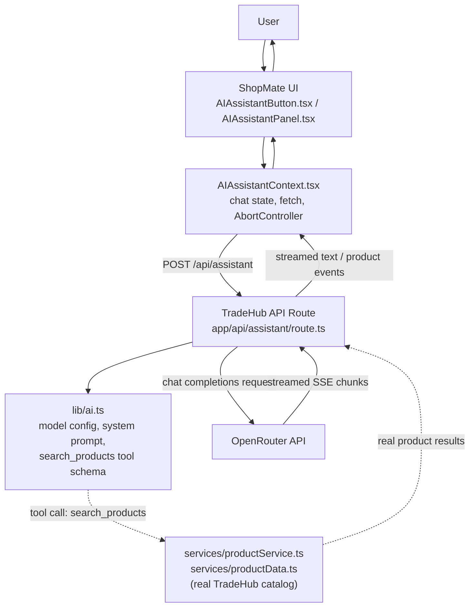

# TradeHub

TradeHub is a wholesale/B2B-style e-commerce marketplace capstone project built with Next.js. Buyers browse a real product catalog with tiered bulk pricing, message verified suppliers, and manage carts, wishlists, and orders — with an integrated AI Shopping Assistant, **ShopMate**, built directly into the storefront to help shoppers find products from the real catalog.


---

## Table of Contents

- [Overview](#overview)
- [Key Features](#key-features)
- [AI Shopping Assistant — ShopMate](#ai-shopping-assistant--shopmate)
- [AI Architecture](#ai-architecture)
- [Tech Stack](#tech-stack)
- [Project Structure](#project-structure)
- [Getting Started](#getting-started)
- [Environment Variables](#environment-variables)
- [Available Scripts](#available-scripts)
- [Security](#security)
- [Accessibility](#accessibility)
- [SEO](#seo)
- [AI-Assisted Development](#ai-assisted-development)
- [Documentation](#documentation)
- [Limitations](#limitations)
- [Future Improvements](#future-improvements)
- [License / Project Status](#license--project-status)

---

## Overview

TradeHub connects buyers with verified suppliers across categories such as automobiles, tech, home interiors, tools, sports, pets, machinery, and gifts. It is designed around a bulk/wholesale purchase model rather than single-unit retail: every product carries quantity-based price tiers (the more you order, the lower the per-unit price), and the primary action on a product page is a supplier quote/inquiry flow, alongside a full cart-and-checkout path for direct purchase.

**Architecture, honestly stated:** this is a frontend-focused capstone/prototype. The product catalog, pricing logic, filtering, and marketplace flows are real and fully functional. There is **no production backend or database** — all user-specific data (accounts, cart, wishlist, orders, saved addresses) is persisted client-side in the browser's `localStorage`, scoped per signed-in account. This is a deliberate scope decision for a capstone project, disclosed directly in the app's own UI (the auth pages show an explicit "Prototype" notice).

## Key Features

The features below reflect what is actually implemented in the codebase. Storefront functionality does not depend on any external service and has been exercised directly. AI Assistant functionality that requires a live OpenRouter API key is implemented and accurately described below, but has not yet completed final end-to-end testing with a real key — see [AI Shopping Assistant](#ai-shopping-assistant--shopmate) and [Limitations](#limitations).

- **Category browsing & search** — a mega-menu category flyout with live product previews, a navbar search field with a recent-searches dropdown (`localStorage`-backed) and live product suggestions, and token-based catalog search (multi-word queries match across product name, description, and brand).
- **Filtering, sorting & pagination** — server-rendered, fully URL-driven listing page: category, brand, condition, rating, price range, verified-only, and deals-only filters, plus sorting, with filter state living in the query string so results are bookmarkable and shareable.
- **Product detail pages** — quantity-based price tiers, full specs, customer reviews, a content-based "related products" recommendation engine, and the assigned supplier for that product.
- **Supplier information & messaging** — each product carries an assigned supplier (name, verified badge); buyers can message a supplier directly about a specific product, with conversation threads shown under Messages.
- **Cart & checkout** — supports both guest checkout and signed-in checkout; cart contents are scoped per signed-in account (and separately for guests), not shared across different accounts in the same browser.
- **Wishlist** — sign-in gated, scoped per account.
- **Order history** — placed orders are saved per signed-in account and viewable from the profile page.
- **Authentication (prototype)** — sign in / create account, available both as a full-page flow and as a contextual popup dialog for account-gated actions. Includes real validation, accurate error messages (distinguishing "no account for this email" from "wrong password"), and an OTP-style password-reset flow gated behind a verification code. This is a local, `localStorage`-backed mock system with no real backend, disclosed directly in the UI.
- **Profile & addresses** — editable name/email/phone (kept in sync with sign-in credentials), saved addresses, and order history.
- **Currency & delivery-country selection** — prices convert across currencies; product shipping availability reflects the selected delivery country.
- **Responsive design** — a dedicated mobile hamburger navigation drawer, responsive listing/filter layouts, and touch-friendly controls.
- **Accessibility** — see [Accessibility](#accessibility).
- **SEO** — see [SEO](#seo).
- **Help Center** — real content covering getting started, shipping, and returns/refunds, with quick-action shortcuts into the rest of the app.
- **AI Shopping Assistant (ShopMate)** — see below.

## AI Shopping Assistant — ShopMate

ShopMate is not a separate application — it is a chat panel built directly into the TradeHub storefront, opened from a button in the navbar, and it answers shopping questions using TradeHub's own product catalog.

> **Testing status:** the capabilities below reflect what is implemented in `app/api/assistant/route.ts` and `lib/ai.ts`. Behavior that requires no live key — such as the "not configured yet" message shown when `OPENROUTER_API_KEY` is missing — has been confirmed directly. Full end-to-end behavior against a live OpenRouter key (streaming, tool-calling, cancellation, multi-turn conversation) is implemented but still requires final end-to-end testing with a real key before it should be considered fully verified.

- **Integration point:** `components/AIAssistantButton.tsx` (navbar trigger) and `components/AIAssistantPanel.tsx` (the chat UI) are rendered once at the app root (`app/layout.tsx`), alongside every other page — ShopMate is available from anywhere in TradeHub, not a standalone page.
- **Provider:** [OpenRouter](https://openrouter.ai) — not a direct Anthropic/Claude API integration, and not any other provider. Implemented as a plain `fetch()` call to OpenRouter's OpenAI-compatible chat completions endpoint (`app/api/assistant/route.ts`); no AI provider SDK is used.
- **Free tier only, by design:** the app defaults to OpenRouter's `openrouter/free` model router and includes a runtime guard (`lib/ai.ts`) that refuses to call any model that is not free — checked on every request, not only at startup.
- **Grounded in the real catalog, not invented products:** the assistant can call one tool, `search_products` (defined in `lib/ai.ts`), which runs against TradeHub's actual product data via `services/productService.ts` and `services/productData.ts` — the same filtering logic the listing page itself uses. The system prompt explicitly instructs the model never to state a product, price, or brand that did not come from a real tool result.
- **Streaming responses:** replies stream token-by-token over Server-Sent Events, with a "thinking" indicator shown before the first token and a "Jump to latest" control while scrolled away during streaming.
- **Cancellation:** a Stop button aborts the in-progress generation, on both the client request and the upstream call to OpenRouter, via a shared `AbortController`.
- **Multi-turn conversation:** the current message history is sent with each request, so follow-up questions retain context; the conversation itself is held in memory and resets on a page reload (see [Limitations](#limitations)).
- **Product cards:** when the tool returns matching products, they are rendered as real, clickable product cards in the chat panel, linking to their actual TradeHub product pages — not described only in text.
- **Markdown rendering:** assistant replies are rendered with `react-markdown`.
- **Error handling:** a missing API key or an upstream failure produces a clear, generic message in the chat UI rather than an unhandled failure or a leaked error body.
- **Responsive & accessible:** the panel is usable at mobile and desktop widths, and implements a keyboard focus trap while open, visible focus indicators, and returns focus to the triggering button on close.
- **Server-side API key handling:** `OPENROUTER_API_KEY` is read only inside `app/api/assistant/route.ts` and is never sent to the browser in any form.

## AI Architecture



**How the pieces fit together:**
- `AIAssistantButton.tsx` toggles the panel open/closed and is the only visible entry point in the navbar.
- `AIAssistantPanel.tsx` is the chat UI itself — message list, the composer, the Stop button, and the "thinking" indicator.
- `AIAssistantContext.tsx` holds the conversation state, sends the `fetch()` request to the API route, parses the streamed response, and owns the `AbortController` used for cancellation.
- `app/api/assistant/route.ts` is the **only** server-side code that talks to OpenRouter. It reads `OPENROUTER_API_KEY`, enforces the free-model guard, streams OpenRouter's response back to the client, and — when the model calls the `search_products` tool — executes that tool server-side.
- `lib/ai.ts` defines the model configuration, the system prompt, and the `search_products` tool schema; it never reads `process.env` itself — only `route.ts` does.
- `services/productService.ts` and `services/productData.ts` are TradeHub's own catalog and filtering logic — the same functions the listing page uses — so the assistant's tool results and the storefront's own search results come from one shared source of truth, not two separate implementations.

## Tech Stack

Taken directly from `package.json`.

**Core**
- [Next.js](https://nextjs.org) `16.3.3` (App Router, Turbopack)
- [React](https://react.dev) `19.2.8` / `react-dom` `19.2.8`
- [TypeScript](https://www.typescriptlang.org) `^5` (strict mode)

**Libraries**
- [`lucide-react`](https://lucide.dev) `^1.34.0` — icon set
- [`react-markdown`](https://github.com/remarkjs/react-markdown) `^10.1.0` — renders ShopMate's replies

**Tooling**
- ESLint `^9` with `eslint-config-next` `16.3.3`
- `@types/node`, `@types/react`, `@types/react-dom`

**Styling:** CSS Modules on one shared design-token stylesheet (`app/globals.css`) — no CSS framework or UI component library.

**Not present in this project** (stated for clarity, not as a gap): no database, no ORM, no backend framework, no AI provider SDK, no state-management library beyond React Context, no automated test runner.

## Project Structure

```
ecommerce-app/
├── app/                       # Next.js App Router — one folder per route
│   ├── api/assistant/         # The only server route that talks to OpenRouter
│   ├── product/[id]/          # Dynamic product detail page
│   ├── listing/                # Server-rendered, filterable product listing
│   ├── cart/ checkout/        # Cart and checkout flows
│   ├── profile/                # Account, orders, addresses
│   ├── messages/               # Buyer↔supplier inquiry threads
│   ├── sign-in/ sign-up/      # Full-page authentication routes
│   ├── support/                # Help Center content
│   ├── sitemap-index/         # Human-readable site index page
│   ├── sitemap.ts             # Machine-readable /sitemap.xml
│   ├── layout.tsx             # Root layout — composes every Context provider
│   └── globals.css            # Design tokens + accessibility/base styles
├── components/                 # Reusable UI components
│   ├── AIAssistantButton.tsx  # ShopMate's navbar trigger
│   ├── AIAssistantPanel.tsx   # ShopMate's chat UI
│   ├── Navbar.tsx / Footer.tsx
│   ├── ProductCard.tsx / ProductGallery.tsx / ProductPurchasePanel.tsx
│   ├── Dialog.tsx              # Shared accessible modal, reused by several dialogs
│   └── ...
├── context/                     # React Context providers (client state)
│   ├── AIAssistantContext.tsx # ShopMate's chat/streaming state
│   ├── AuthContext.tsx / AuthModalContext.tsx
│   ├── CartContext.tsx / WishlistContext.tsx
│   ├── CurrencyContext.tsx / ShipCountryContext.tsx
│   └── ConfirmDialogContext.tsx
├── hooks/                       # useAuthForm, useDisclosure, useSearchHistory
├── services/                    # Pure functions + data — no React/DOM dependency
│   ├── productData.ts          # The product catalog itself
│   ├── productService.ts       # Filtering, search, sorting, recommendations
│   ├── authAccountService.ts   # Local "account book" behind sign-in
│   ├── orderService.ts         # Per-account order history
│   └── searchHistoryService.ts
├── lib/ai.ts                    # ShopMate's model / system-prompt / tool configuration
├── types/product.ts             # Shared TypeScript types for the catalog
└── public/images/               # Product and UI imagery
```

**Why this structure:** `services/` is deliberately kept free of React/DOM dependencies so the same functions can run in both Server and Client Components without duplication — and so ShopMate's tool call reuses the exact same catalog logic as the storefront pages. `context/` holds only cross-cutting, per-visitor state; anything that doesn't need to be global stays as local component state. `lib/ai.ts` is the single place ShopMate's model, prompt, and tool schema are defined.

## Getting Started

**Prerequisites:** Node.js (a version compatible with Next.js 16 and React 19) and npm.

1. **Enter the project directory.**
2. **Install dependencies:**
   ```bash
   npm install
   ```
3. **Configure environment variables** — see [Environment Variables](#environment-variables) below.
4. **Start the development server:**
   ```bash
   npm run dev
   ```
5. **Open** [http://localhost:3000](http://localhost:3000) in your browser.

The storefront (browsing, cart, wishlist, checkout, auth) works immediately with no configuration. ShopMate requires the environment variable below to respond — without it, opening the panel shows a clear "not configured yet" message rather than failing silently.

## Environment Variables

Create a `.env.local` file in the project root:

```env
# Required for ShopMate to respond.
# Get a key from https://openrouter.ai — use a free-tier key.
OPENROUTER_API_KEY=your_openrouter_api_key_here

# Optional. Defaults to "openrouter/free" if not set.
# Must resolve to a free model — the app refuses to call anything else.
OPENROUTER_MODEL=openrouter/free
```

No other environment variables are read anywhere in this codebase.

- **`.env.local` is local and private.** Never commit it, and never share its contents.
- **Never expose the key to client-side code.** Both variables are read only inside `app/api/assistant/route.ts`, a server-only Route Handler, and are never sent to the browser in any form.
- **Never prefix the secret with `NEXT_PUBLIC_`.** Doing so would make Next.js bundle it into client-side JavaScript; neither variable uses that prefix.
- **`.gitignore` already excludes environment files** — it contains a `.env*` pattern, so `.env.local` is excluded by the project's own configuration.

## Available Scripts

Exactly as defined in `package.json`:

| Command | Description |
|---|---|
| `npm run dev` | Starts the development server (Turbopack) at `http://localhost:3000`. |
| `npm run build` | Creates an optimized production build. |
| `npm run start` | Runs the production build (run `npm run build` first). |
| `npm run lint` | Runs ESLint against the project. |

There is no configured automated test runner in this project — no test script exists in `package.json`.

## Security

- **Server-only secret handling.** `OPENROUTER_API_KEY` is read exclusively inside `app/api/assistant/route.ts`. `lib/ai.ts`, which that route imports from, never touches `process.env` itself. Neither AI-related variable is prefixed `NEXT_PUBLIC_`, so neither is ever bundled into client-side JavaScript.
- **No secret leakage in error responses.** A missing key or an upstream OpenRouter failure returns a fixed, generic message — never the raw upstream response body, a stack trace, or the environment value itself.
- **A hard cost-control guard.** The AI route checks, on every request, that the configured model is actually a free OpenRouter model, and refuses to proceed otherwise — this is a runtime check, not only a configuration convention.
- **Sign-in enumeration protection.** `hooks/useAuthForm.ts` was designed with an account-security consideration: password-reset and sign-in flows avoid revealing more than necessary about which emails are registered where that matters.
- **Authentication is a local prototype, not production security.** Accounts and passwords are stored in `localStorage`, disclosed directly in the UI. There is no encrypted credential storage and no server-side session — do not reuse real passwords when testing.
- **No real payment processing** exists in this project.

## Accessibility

Verified directly in the implementation:

- A skip-link, hidden until focused, as the first focusable element on every page.
- A global, consistently applied `:focus-visible` indicator on every interactive element type — buttons, links, inputs, selects, and textareas.
- A 44px minimum touch target applied globally and re-applied on custom controls.
- `prefers-reduced-motion: reduce` support, handled once, globally.
- Native `<dialog>` elements for modals (`components/Dialog.tsx`, the mobile navigation drawer, the mobile filter drawer), which provide real focus containment and Escape-to-close, plus an explicit fix for a cross-engine Tab-cycling gap in the native element.
- **ShopMate's panel specifically** implements its own keyboard focus trap while open (it is intentionally not a native `<dialog>`, since the rest of the page must stay usable while it's open), visible focus indicators throughout, and returns focus to the triggering navbar button when closed.
- Keyboard-operable navigation menus, including a category flyout that opens on keyboard focus, not only on mouse hover or click.

This project has not undergone a formal screen-reader audit or an automated accessibility-tooling pass (e.g. axe-core, Lighthouse) — see [Limitations](#limitations).

## SEO

Verified directly in `app/layout.tsx` and route-level metadata:

- Per-route metadata via Next.js's `Metadata` API, with a title template applied site-wide.
- Canonical URLs on key pages.
- Open Graph and Twitter Card metadata, set at the root layout and inherited by pages that don't override it.
- JSON-LD structured data — an `Organization` schema site-wide, and a `Product` schema on every product detail page.
- A machine-readable sitemap (`app/sitemap.ts`, generating `/sitemap.xml`) covering static routes, category listings, and every product page.
- A human-readable site index page (`/sitemap-index`) for visitor navigation.
- `robots` metadata configured for indexing, with account-flow pages (sign-in/sign-up) explicitly excluded from indexing.

## AI-Assisted Development

AI tools (Claude, via Claude Code) were used throughout this project as **development assistance under my direction and review** — for implementation help, debugging, accessibility review, and documentation. AI-proposed changes were inspected and tested against the running application, then accepted, corrected, or rejected individually. AI was not used to build this project autonomously, and no claim in this README or the documentation below states otherwise.

## Documentation

This repository includes several detailed reports produced during development:

- **[`CAPSTONE_DEVELOPMENT_REPORT.md`](./CAPSTONE_DEVELOPMENT_REPORT.md)** — the primary capstone engineering report: architecture, engineering decisions, real bugs found and fixed, and performance/accessibility/SEO analysis.
- **[`AI_ASSISTED_DEVELOPMENT_REPORT.md`](./AI_ASSISTED_DEVELOPMENT_REPORT.md)** and **[`AI_DEVELOPMENT_JOURNEY.md`](./AI_DEVELOPMENT_JOURNEY.md)** — two further, independently-produced accounts of the development process and AI-assisted workflow.
- **[`docs/AI-ASSISTED-DEVELOPMENT-REPORT.md`](./docs/AI-ASSISTED-DEVELOPMENT-REPORT.md)** — an additional development report, filed under `docs/`.

## Limitations

- **No production backend or database.** The catalog is static application data; all user-specific data (accounts, cart, wishlist, orders, addresses) lives in the browser's `localStorage` only.
- **Authentication is a local prototype**, not a production auth system — see [Security](#security).
- **No real payment processing.**
- **ShopMate depends on OpenRouter's free tier** — subject to that service's availability and rate limits, and the exact underlying model can vary between requests since a model *router*, not one fixed model, is used by default.
- **ShopMate's conversation is not persisted** — the chat history resets on a full page reload.
- **ShopMate end-to-end testing is still pending.** Streaming, tool-calling, cancellation, and multi-turn behavior are implemented, but final verification against a live OpenRouter API key has not yet been completed.
- **No automated test suite.** Verification during development relied on manual and scripted (not CI-enforced) testing; see `CAPSTONE_DEVELOPMENT_REPORT.md` for a full breakdown.
- **No formal accessibility audit** (screen-reader testing or automated tooling) has been performed.

## Future Improvements

The following are realistic future directions, not existing functionality:

- A real backend and database, replacing the current `localStorage`-based persistence.
- Production-grade authentication (hashed credentials, real sessions).
- Real payment processing integration.
- Persisting ShopMate's conversation across page reloads.
- A formal accessibility audit (automated tooling plus a manual screen-reader pass).
- An automated test suite.
- Production deployment configuration.

## License / Project Status

This repository does not currently include a `LICENSE` file. TradeHub is a capstone/educational project, not a licensed open-source release.
