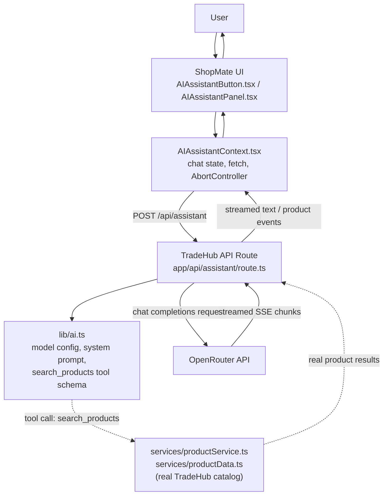

# TradeHub

TradeHub is a wholesale/B2B-style e-commerce marketplace built with Next.js. Buyers browse a real product catalog with tiered bulk pricing, message verified suppliers, and manage carts, wishlists, and orders — with an integrated AI Shopping Assistant, **ShopMate**, built directly into the storefront to help shoppers find products from the real catalog through natural conversation.


**Live app:** [ecommerce-ai-capstone.vercel.app](https://ecommerce-ai-capstone.vercel.app/) · **Source:** [github.com/Hafsa0104/ecommerce-ai-capstone](https://github.com/Hafsa0104/ecommerce-ai-capstone)

---

## Table of Contents

- [Project Brief](#project-brief)
- [Overview](#overview)
- [Key Features](#key-features)
- [AI Shopping Assistant — ShopMate](#ai-shopping-assistant--shopmate)
- [AI Architecture](#ai-architecture)
- [Tech Stack](#tech-stack)
- [Project Structure](#project-structure)
- [Getting Started](#getting-started)
- [Environment Variables](#environment-variables)
- [Available Scripts](#available-scripts)
- [Deployment](#deployment)
- [Testing](#testing)
- [Performance](#performance)
- [Accessibility](#accessibility)
- [SEO](#seo)
- [Security](#security)
- [AI-Assisted Development](#ai-assisted-development)
- [Documentation](#documentation)
- [Limitations](#limitations)
- [Future Improvements](#future-improvements)
- [Reflection](#reflection)
- [License / Project Status](#license--project-status)

---

## Project Brief

Bulk/wholesale sourcing is poorly served by generic consumer storefronts: a business buyer typically has to compare per-unit prices across separate supplier listings with no shared context, no quantity-based pricing, and no fast way to describe what they need and get a grounded answer back. TradeHub is a single marketplace built around that problem — every product carries real quantity-based price tiers, every listing is tied to a verified supplier a buyer can message directly, and an integrated AI assistant, ShopMate, can search the same real catalog on the buyer's behalf instead of requiring them to work through filters manually. It's built for buyers sourcing products in bulk from suppliers, and designed to demonstrate a genuinely non-trivial frontend — tiered pricing, URL-driven filtering/sorting/pagination, per-account data isolation, accessible modal and navigation patterns — paired with an AI feature that is meaningfully grounded in the application's own data rather than a chatbot bolted on top with no real connection to the catalog.

## Overview

TradeHub connects buyers with verified suppliers across categories such as automobiles, tech, home interiors, tools, sports, pets, machinery, and gifts. It's built around a bulk/wholesale purchase model rather than single-unit retail: every product carries quantity-based price tiers (the more you order, the lower the per-unit price), and the primary action on a product page is a supplier quote/inquiry flow, alongside a full cart-and-checkout path for direct purchase.

The product catalog, pricing logic, filtering, and marketplace flows are all real and fully functional. TradeHub is a frontend-focused project: there's no production backend or database, and user-specific data (accounts, cart, wishlist, orders, saved addresses) is persisted client-side in the browser's `localStorage`, scoped per signed-in account. This is a deliberate scope decision, disclosed directly in the app's own UI via an explicit "Prototype" notice on the auth pages.

## Key Features

- **Category browsing & search** — a mega-menu category flyout with live product previews, a navbar search field with a recent-searches dropdown and live product suggestions, and token-based catalog search (multi-word queries match across product name, description, and brand).
- **Filtering, sorting & pagination** — a server-rendered, fully URL-driven listing page: category, brand, condition, rating, price range, verified-only, and deals-only filters, plus sorting, with filter state living in the query string so results are bookmarkable and shareable.
- **Product detail pages** — quantity-based price tiers, full specs, customer reviews, a content-based "related products" recommendation engine, and the assigned supplier for that product.
- **Supplier information & messaging** — each product carries an assigned supplier (name, verified badge); buyers can message a supplier directly about a specific product, with conversation threads shown under Messages.
- **Cart & checkout** — supports both guest checkout and signed-in checkout; cart contents are scoped per signed-in account (and separately for guests).
- **Wishlist** — sign-in gated, scoped per account.
- **Order history** — placed orders are saved per signed-in account and viewable from the profile page.
- **Authentication** — sign in / create account, available both as a full-page flow and as a contextual popup dialog for account-gated actions, with real validation, clear error messages (distinguishing "no account for this email" from "wrong password"), and an OTP-style password-reset flow gated behind a verification code.
- **Profile & addresses** — editable name/email/phone, saved addresses, and order history.
- **Currency & delivery-country selection** — prices convert across currencies; product shipping availability reflects the selected delivery country.
- **Responsive design** — a dedicated mobile hamburger navigation drawer, responsive listing/filter layouts, and touch-friendly controls.
- **Help Center** — real content covering getting started, shipping, and returns/refunds, with quick-action shortcuts into the rest of the app.
- **AI Shopping Assistant (ShopMate)** — see below.

## AI Shopping Assistant — ShopMate

ShopMate is a chat panel built directly into the TradeHub storefront, opened from a button in the navbar, that helps shoppers find products using natural conversation instead of manual filtering — grounded entirely in TradeHub's own catalog.

- **Provider:** [OpenRouter](https://openrouter.ai), called directly via `fetch()` against its OpenAI-compatible chat completions endpoint (`app/api/assistant/route.ts`) — no AI provider SDK.
- **Free tier by design:** the app uses OpenRouter's `openrouter/free` model router, with a runtime guard (`isFreeModelId()` in `lib/ai.ts`) that checks every request and refuses to call anything but a free model.
- **System prompt:** `lib/ai.ts`'s `SYSTEM_PROMPT` gives ShopMate a clear persona — "the shopping assistant built into this e-commerce marketplace, not a general-purpose chatbot" — instructs it to ask a short follow-up question when it's missing budget/use-case/quantity rather than guess, to use the `search_products` tool before recommending anything, and never to state a product, price, or spec that didn't come from a real tool result.
- **Grounded in the real catalog:** the assistant calls one tool, `search_products`, which runs against TradeHub's actual product data via `services/productService.ts` and `services/productData.ts` — the same filtering logic the listing page itself uses. There's no separate or synthetic data source for the AI.
- **Streaming responses:** replies stream token-by-token over Server-Sent Events, with a "thinking" indicator before the first token and a "Jump to latest" control while scrolled away during streaming.
- **Cancellation:** a Stop button aborts the in-progress generation on both the client and the upstream OpenRouter call, via a shared `AbortController` threaded from `AIAssistantContext.tsx` through `app/api/assistant/route.ts`.
- **Multi-turn conversation:** the current message history is sent with each request, so follow-up questions retain context; the conversation lives in memory for the session and resets on a page reload.
- **Product cards:** when the tool returns matches, they render as real, clickable product cards in the chat panel linking to their actual TradeHub product pages.
- **Markdown rendering:** assistant replies render with `react-markdown`.
- **Error handling:** a missing API key, a non-free model, or an upstream failure each produce a clear, generic message in the chat UI — never a leaked error body or stack trace. The underlying cause is logged server-side only, so it stays diagnosable without ever reaching the browser.
- **Accessible:** the panel implements a keyboard focus trap while open, visible focus indicators, and returns focus to the triggering navbar button on close.
- **Server-side key handling:** `OPENROUTER_API_KEY` is read only inside `app/api/assistant/route.ts` and never reaches the browser in any form.

## AI Architecture



**How the pieces fit together:**
- `AIAssistantButton.tsx` toggles the panel open/closed — the only visible entry point in the navbar.
- `AIAssistantPanel.tsx` is the chat UI — message list, composer, Stop button, and "thinking" indicator.
- `AIAssistantContext.tsx` holds the conversation state, sends the request to the API route, parses the streamed SSE response, and owns the `AbortController` used for cancellation.
- `app/api/assistant/route.ts` is the only server-side code that talks to OpenRouter. It reads `OPENROUTER_API_KEY`, enforces the free-model guard, streams the response back to the client, and executes `search_products` server-side when the model calls it.
- `lib/ai.ts` defines the model configuration, system prompt, and tool schema; it never reads `process.env` — only `route.ts` does.
- `services/productService.ts` and `services/productData.ts` are TradeHub's catalog and filtering logic, shared between the listing page and ShopMate's tool call — one source of truth, not two implementations.

## Tech Stack

**Core**
- [Next.js](https://nextjs.org) `16.3.3` (App Router, Turbopack)
- [React](https://react.dev) `19.2.8` / `react-dom` `19.2.8`
- [TypeScript](https://www.typescriptlang.org) `^5` (strict mode)

**Libraries**
- [`lucide-react`](https://lucide.dev) — icon set
- [`react-markdown`](https://github.com/remarkjs/react-markdown) — renders ShopMate's replies

**Tooling:** ESLint with `eslint-config-next`.

**Styling:** CSS Modules on one shared design-token stylesheet (`app/globals.css`) — no CSS framework or UI component library.

No database, ORM, backend framework, AI provider SDK, or state-management library beyond React Context — kept deliberately lean.

## Project Structure

```
ecommerce-app/
├── app/                       # Next.js App Router — one folder per route
│   ├── api/assistant/         # The only server route that talks to OpenRouter
│   ├── product/[id]/          # Dynamic product detail page
│   ├── listing/                # Server-rendered, filterable product listing
│   ├── cart/ checkout/        # Cart and checkout flows
│   ├── profile/                # Account, orders, addresses
│   ├── messages/               # Buyer↔supplier inquiry threads
│   ├── sign-in/ sign-up/      # Full-page authentication routes
│   ├── support/                # Help Center content
│   ├── sitemap-index/         # Human-readable site index page
│   ├── sitemap.ts             # Machine-readable /sitemap.xml
│   ├── layout.tsx             # Root layout — composes every Context provider
│   └── globals.css            # Design tokens + accessibility/base styles
├── components/                 # Reusable UI components
│   ├── AIAssistantButton.tsx  # ShopMate's navbar trigger
│   ├── AIAssistantPanel.tsx   # ShopMate's chat UI
│   ├── Navbar.tsx / Footer.tsx
│   ├── ProductCard.tsx / ProductGallery.tsx / ProductPurchasePanel.tsx
│   ├── Dialog.tsx              # Shared accessible modal, reused by several dialogs
│   └── ...
├── context/                     # React Context providers (client state)
│   ├── AIAssistantContext.tsx # ShopMate's chat/streaming state
│   ├── AuthContext.tsx / AuthModalContext.tsx
│   ├── CartContext.tsx / WishlistContext.tsx
│   ├── CurrencyContext.tsx / ShipCountryContext.tsx
│   └── ConfirmDialogContext.tsx
├── hooks/                       # useAuthForm, useDisclosure, useSearchHistory
├── services/                    # Pure functions + data — no React/DOM dependency
│   ├── productData.ts          # The product catalog itself
│   ├── productService.ts       # Filtering, search, sorting, recommendations
│   ├── authAccountService.ts   # Local "account book" behind sign-in
│   ├── orderService.ts         # Per-account order history
│   └── searchHistoryService.ts
├── lib/ai.ts                    # ShopMate's model / system-prompt / tool configuration
├── types/product.ts             # Shared TypeScript types for the catalog
└── public/images/               # Product and UI imagery
```

**Why this structure:** `services/` stays free of React/DOM dependencies so the same functions run in both Server and Client Components — and so ShopMate's tool call reuses the exact same catalog logic as the storefront pages. `context/` holds only cross-cutting, per-visitor state; `lib/ai.ts` is the single place ShopMate's model, prompt, and tool schema are defined.

## Getting Started

**Prerequisites:** Node.js (a version compatible with Next.js 16 and React 19) and npm.

1. **Enter the project directory.**
2. **Install dependencies:**
   ```bash
   npm install
   ```
3. **Configure environment variables** — see [Environment Variables](#environment-variables) below.
4. **Start the development server:**
   ```bash
   npm run dev
   ```
5. **Open** [http://localhost:3000](http://localhost:3000) in your browser.

The storefront (browsing, cart, wishlist, checkout, auth) works immediately with no configuration. ShopMate needs the environment variable below to respond — without it, the panel shows a clear "not configured yet" message.

## Environment Variables

Create a `.env.local` file in the project root:

```env
# Required for ShopMate to respond.
# Get a key from https://openrouter.ai — use a free-tier key.
OPENROUTER_API_KEY=your_openrouter_api_key_here

# Optional. Defaults to "openrouter/free" if not set.
# Must resolve to a free model — the app refuses to call anything else.
OPENROUTER_MODEL=openrouter/free
```

No other environment variables are read anywhere in this codebase.

- `.env.local` is local and private — never committed, never shared.
- Both variables are read only inside `app/api/assistant/route.ts`, a server-only Route Handler, and are never sent to the browser.
- Neither variable is prefixed `NEXT_PUBLIC_`, so neither is ever bundled into client-side JavaScript.
- `.gitignore` excludes environment files via a `.env*` pattern.

## Available Scripts

| Command | Description |
|---|---|
| `npm run dev` | Starts the development server (Turbopack) at `http://localhost:3000`. |
| `npm run build` | Creates an optimized production build. |
| `npm run start` | Runs the production build (run `npm run build` first). |
| `npm run lint` | Runs ESLint against the project. |

## Deployment

TradeHub is deployed on Vercel:

- **Production:** [https://ecommerce-ai-capstone.vercel.app/](https://ecommerce-ai-capstone.vercel.app/)
- **Repository:** [https://github.com/Hafsa0104/ecommerce-ai-capstone](https://github.com/Hafsa0104/ecommerce-ai-capstone)

Deploying requires setting `OPENROUTER_API_KEY` (and optionally `OPENROUTER_MODEL`) as environment variables on the hosting platform, the same as in local development — the app reads them the same way in both environments, and nothing about the AI integration depends on running locally.

**Failure-safe behavior:** a missing API key or a non-free model configuration is caught before any request is sent, with a clear message rather than a crash; an upstream OpenRouter failure (rate limiting, an outage, a malformed response) falls back to a generic, safe message in the chat UI while the real cause is logged server-side only; clicking Stop cleanly cancels the in-progress request end-to-end and leaves the panel usable; an invalid request to the API route is rejected with a clear 400 rather than an unhandled error; a product id that doesn't exist resolves to a real 404 via Next.js's `notFound()`; and sign-in distinguishes "no account found" from "incorrect password" instead of one vague message.

**Rollback:** since the project has no database, rolling back is just redeploying a previous known-good commit from the platform's deployment history — there's no data-migration risk, since the only state that matters (`localStorage`) is per-browser and unaffected by which build is live.

## Testing

TradeHub was validated through manual functional testing and developer-side verification of its key user flows: storefront navigation, category and keyword search, filtering/sorting/pagination, cart and checkout, wishlist, sign-in/sign-up and password reset, profile and address management, order history, currency and delivery-country selection, and responsive/mobile behavior. ShopMate was verified end-to-end against a live OpenRouter key — a basic greeting, a product-search query returning real catalog product cards linked to real product pages, a follow-up question that correctly retained prior conversation context, a deliberately unmatchable query answered honestly with no fabricated products, and Stop mid-response leaving the partial reply intact with the panel still usable. Type-checking and linting (`npm run build`'s TypeScript pass and `npm run lint`) run clean on the current codebase.

This verification was manual and developer-driven rather than an automated, CI-enforced suite — a natural next step for the project is described under [Future Improvements](#future-improvements).

## Performance

- **Rendering strategy chosen per page.** The Home and Product pages use Incremental Static Regeneration (`revalidate = 3600`), with `generateStaticParams()` pre-building every product page at build time. The Listing page renders per-request instead, since its content depends on the active filters in the query string — a deliberate choice, not a missed optimization.
- **Image optimization via `next/image`** across product cards, galleries, and UI imagery, handling responsive sizing and below-the-fold lazy-loading.
- **Streaming AI responses**, so ShopMate's replies render incrementally rather than waiting for the full response — a perceived-latency win on the app's slowest network call.
- **A lightweight client bundle:** no UI component library, no CSS-in-JS runtime, no state-management library beyond React Context, and CSS Modules compiled away at build time rather than shipped as runtime JS.
- **`prefers-reduced-motion: reduce` support**, handled globally in `app/globals.css`.
- **Layout stability:** dialogs use the native `<dialog>` element rather than a JS-positioned overlay, and product imagery through `next/image` reserves layout space from known dimensions.

A Lighthouse pass hasn't been formally recorded against the production deployment; the decisions above are the ones actually driving the app's performance characteristics.

## Accessibility

- A skip-link, hidden until focused, as the first focusable element on every page.
- A global, consistently applied `:focus-visible` indicator on every interactive element type — buttons, links, inputs, selects, and textareas.
- A 44px minimum touch target applied globally and re-applied on custom controls.
- `prefers-reduced-motion: reduce` support, handled once, globally.
- Native `<dialog>` elements for modals (`components/Dialog.tsx`, the mobile navigation drawer, the mobile filter drawer), with real focus containment, Escape-to-close, and a fix for a cross-engine Tab-cycling gap in the native element.
- ShopMate's panel implements its own keyboard focus trap while open (intentionally not a native `<dialog>`, since the rest of the page stays usable while it's open), visible focus indicators throughout, and returns focus to the triggering navbar button on close.
- Keyboard-operable navigation menus, including a category flyout that opens on keyboard focus, not only on mouse hover or click.

These are implementation-level accessibility choices verified directly in the code; a formal external audit (screen reader, WAVE/axe) hasn't been run against the deployment.

## SEO

- Per-route metadata via Next.js's `Metadata` API, with a site-wide title template.
- Canonical URLs on key pages.
- Open Graph and Twitter Card metadata, set at the root layout and inherited by pages that don't override it.
- JSON-LD structured data — an `Organization` schema site-wide, and a `Product` schema on every product detail page.
- A machine-readable sitemap (`app/sitemap.ts`, generating `/sitemap.xml`) covering static routes, category listings, and every product page.
- A human-readable site index page (`/sitemap-index`) for visitor navigation.
- `robots` metadata configured for indexing, with account-flow pages (sign-in/sign-up) excluded from indexing.

## Security

- **Server-only secret handling.** `OPENROUTER_API_KEY` is read exclusively inside `app/api/assistant/route.ts`; `lib/ai.ts` never touches `process.env`. Neither AI-related variable is prefixed `NEXT_PUBLIC_`, so neither is ever bundled into client-side JavaScript.
- **No secret leakage in error responses.** A missing key, a non-free model, or an upstream failure each return a fixed, generic message — never the raw upstream response, a stack trace, or the key itself. The real cause is logged server-side only.
- **A hard cost-control guard.** Every request is checked against `isFreeModelId()` before it's sent — a runtime check, not just a configuration convention.
- **Sign-in enumeration protection.** `hooks/useAuthForm.ts` avoids revealing more than necessary about which emails are registered where that matters.
- **Authentication is a local prototype.** Accounts and passwords are stored in `localStorage`, disclosed directly in the UI — there's no encrypted credential storage or server-side session, so real passwords shouldn't be reused here.
- **No real payment processing** exists in this project.
- **No secret is committed to the repository** — `.env.local` is git-ignored, and no key value appears in any tracked file.

## AI-Assisted Development

AI tools (Claude, via Claude Code) were used throughout this project as development assistance under my direction and review — for implementation help, debugging, accessibility review, and documentation. AI-proposed changes were inspected and tested against the running application, then accepted, corrected, or rejected individually.

## Documentation

This repository includes several detailed reports produced during development:

- **[`CAPSTONE_DEVELOPMENT_REPORT.md`](./CAPSTONE_DEVELOPMENT_REPORT.md)** — the primary engineering report: architecture, engineering decisions, bugs found and fixed, and performance/accessibility/SEO analysis.
- **[`AI_ASSISTED_DEVELOPMENT_REPORT.md`](./AI_ASSISTED_DEVELOPMENT_REPORT.md)** and **[`AI_DEVELOPMENT_JOURNEY.md`](./AI_DEVELOPMENT_JOURNEY.md)** — two further accounts of the development process and AI-assisted workflow.
- **[`docs/AI-ASSISTED-DEVELOPMENT-REPORT.md`](./docs/AI-ASSISTED-DEVELOPMENT-REPORT.md)** — an additional development report, filed under `docs/`.

## Limitations

- **No production backend or database** — the catalog is static application data, and user-specific data (accounts, cart, wishlist, orders, addresses) lives in `localStorage`.
- **Authentication is a local prototype**, not a production auth system.
- **No real payment processing.**
- **ShopMate depends on OpenRouter's free tier**, so its availability and rate limits follow that service, and the exact underlying model can vary between requests since a router, not one fixed model, is used by default.
- **ShopMate's conversation resets on a full page reload** rather than persisting across visits.

These are deliberate scope decisions for a frontend-focused capstone project, not oversights — each is disclosed directly in the app's own UI where relevant.

## Future Improvements

- A real backend and database, replacing `localStorage`-based persistence.
- Production-grade authentication (hashed credentials, real sessions).
- Real payment processing integration.
- Persisting ShopMate's conversation across page reloads.
- An automated test suite — unit tests for the pure `services/`/`lib/` logic, plus component or end-to-end coverage for a critical journey like product search or checkout.
- A formal accessibility audit (automated tooling plus a manual screen-reader pass) and a recorded Lighthouse/performance audit.
- Production monitoring and error tracking.

## Reflection

The hardest part of building TradeHub wasn't any single feature — it was keeping the AI integration honest. It's easy to make a chatbot that *sounds* like it works: OpenRouter's API is straightforward, streaming isn't hard to wire up, and a demo where the model just talks confidently is convincing even when it's quietly making things up. The real work was constraining ShopMate so it could only answer from the real catalog via the `search_products` tool, refusing to let it invent a product, price, or spec, and then actually verifying that constraint held rather than trusting a well-written system prompt on its own.

The rest of the app turned out to reward the same instinct in smaller ways — the tiered-pricing model, the shared `filterProducts()` logic between the listing page and ShopMate's tool call, and the per-account `localStorage` scoping for cart/wishlist/orders all came from resisting the shortcut of a special case in favor of one real implementation reused everywhere. If I built this again, I'd set up even a minimal automated test suite from day one — a handful of unit tests around the pure catalog and AI-guard logic costs very little and pays for itself the moment you touch that code again months later. What surprised me most was how much of "AI-enhanced frontend" work is actually plumbing and constraint-design — the interesting problems weren't in prompting the model, they were in making sure it could never say something untrue about a real product.

## License / Project Status

This repository does not currently include a `LICENSE` file. TradeHub is a capstone/educational project, not a licensed open-source release.
